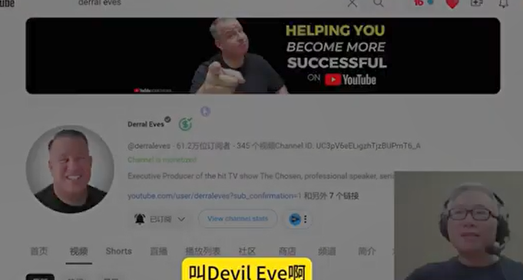

今天开始开讲有关公式，一本书可以讲公式，在他的名字里头，那可是不简单的。啥叫公式？你套用我这个东西就能够有结果，对不对？要不然你怎么敢叫公司呢？所以理论有指导，有实战，这是我给大家推荐的油管宝典。老胡做油管这这么多年挖了很多坑，吹了好多的牛。我在节目里头也讲过，要讲这本书，讲这本书，结果都是虎头蛇尾，抬了个头又没有结尾。

这一次我想了，你保证我会在一个月之内把这本书详细的给大家讲完。好，那为什么要讲这本书？当然因为这本书的价值，它是一个宝典。如果你的我推荐大家去看书的这是唯一的一本书，你需要看别的，你可以不看好。

当然你也可以听我讲解就可以了，看那个书，如果你要买或者是买这个有声书，或者是这个纸质书的话，我一会儿会把链接展示给大家。然后再一下放到留言里面。

好，讲一下这个作者，这个作者叫devil if, 就是这样一个人，他可是个了不起的人物。Miss the beats讲如对油管的理解，**如果他讲第二的话，就没人敢称第一，那当然miss的比他是赞誉之词，是不是过誉呢？**就是啊因为我在游玩这么多年，我见过的这个曾大师，维维大师太多了。

第二个是我非常尊敬的一个在油管方面的前辈，很厉害，这个人也非常好的一个人。

Miss list. 

我也不是在这边吹捧的讲话世界第一，miss bees为了接触他，曾经专门在自己家旁边买了一栋房子送给他，就希望他把这个房子来来住的时候，来休假的时候，能有机会亲近他。你看。

所以从这个层面就是能反映出它的价值，就是在这个地方。好，那你看看他的频道没什么了不起，60万。然后其实这个视频的播放量也不咋地，两千多次，一万次2万次，千万不可小看。

因为它的以我的重点并不是在这个频道里头，早期是在这个频道里头做宣传，现在他基本上是做培训，做策划，做制片人，他有自己的宗教信阳他花很多时间在做其他的电视的节目。好，他，写的这一本书你可以看到就是叫做有关公式翻译过来。

那么他这个地方，在介绍里头有他的成绩，在这个地方他产生了600亿的播放量，他所做的内容，并且他帮24个频道从零做到了100万，所以这是很了不起的成绩。

关于他的个人的这个故事的话，其中一个非常经典的就是老胡以前做过一期这样的节目，在四年以前我讲了这么一期节目，讲如厕脚凳厕所脚凳实际上就是拉拉屎。邓，很简单的一个东西是吧？这个dairy eve给他们做了一个策划，就是拍了这样一个拍了这个广告片。

然后这个广告片八年前四千多万的播放量，所以催生了这样一个火爆的产品，在亚马逊上卖的这个生意过亿。很简单的一个塑料这个制品做成一个大生意。首先这个人在商业运作，在创意，在执行。在**这个关系方面，各方面他他这个相当全面的一个人。**

**他不仅对油管的平台，对人性技术有足够的爱好钻研，而且是能够在实践当中把它用出来，而且产生结果。**所以这是油管的做油管的技术到哪里头，少见的我是佩服的这样的一个人。

所以这本书里头很多非常重要的东西，如果你自己去看的话，不禁能有那么深刻的感受。那老胡的话，结合我自己的东西，可以跟你添油加醋，讲的，也许比你自己看的书会更容易一些，或者是更深刻一些。理解。

好，今天是第一次我带大家来看一下这本书的这个目录，让大家全面的了解一下这本书他讲了一些什么内容，他为什么敢是有关公式，叫名字。好，我们来看一下亚马逊的这个链接。亚马逊链接里头你注意看，这个书的名字叫油管公司，它的副标题是什么东西呢？

它的副标题是我看这个翻译能不能把这个中文带出来，翻译看看副标题，任何人都可以解锁算法，以增加观看次数，建立观众和增加收入。这个副标题是说，我让你了解油管的这个算法能够得到更多的观看次数，能够涨粉，能够赚钱。

所以非常恰当的跟这个书的名字相互的补充，或者是相互的参照，对吧？所以油管的公式说个名字就行，**这是一套公式不完整的新法打法和实践操作，你可以去用它，你使用它可以能够理解算法，而且能够得到播放量..，能够建立社群。有年度的这种观众群，而且能够赚到钱。**

所以苏铭也觉得非常棒，这是很霸气，有王者之气，我很喜欢他这个人整个的，所以这个人他是懂观众的，懂懂心理，懂技术，知道怎么样来吸引观众。怎么样，你有个标题，他就能把你拿住。好，这个书的话，现在亚马逊上有有这个电子版，有这个就是这样子的精装版，就是这样子的。还有一个有声读物的，有声读物的话，他可以。

如果你没有这样一个有声读物的这样的一个账号，你可以去试一下。然后是在试这个试验期间的话，免费试用期间的话，你是不用花钱的。这本书你可以下载，你们是有大概可能下载两本还是几本书。那你记得在收你钱之前，你取消这个账号就可以了。

我知道很多人是特别喜欢这个audio book这样一个服务，它有很多是的确是好，那么我会把这个链接放在置顶的置顶留言当中。现在我们就看一下这个书的这个目录，你看它分为几个部分。

第一个部分平台就是讲整个油管的这个平台，第二部分讲的是这个机遇，就像我们为什么要来做游玩以后管这个平台给我们提供了什么样的一个机会。第三个部分就是真正的这本书的干货部分就是公司部分，就是具体的这个操作和那些实践性的东西。

好，我们再看一下这个章节里头的内容，我们不是每一行都讲到，大概给你勾勒一下这本书的他的这个内容的范畴。首先这个前沿是前言是mister beast帮他写的这个前言，明天我们讲前言和他的自我介绍，明天我们讲讲这两个章节。

好，下面他会讲很多人目前的问题是什么？

他们要帮助客户，给客户产生价值，你才能够成功，那要就是呃有找到兴趣，你看他的指导的这个原则是这个大的方向，那平台里头他讲了什么东西，讲了有关的一些历史，发展的历史，油管的生态。整个这里头他提到了，你看版权这个赚钱是怎么回事，然后油管怎么样，是一个动态的系统，不断的在在向前发展，不断的在政策上面进行调整，这边有一点点历史在这个地方了解一个历史。

对你能够理解整个平台为什么现在长成了这个样子，讲到这个深度学习机器人工智能的这种演变。注意，这个是在GPT在其他东西出来之前，这是2021年的二月份出的一本书，那个时候还没有太多人讲所谓的AI这么一回事。

现在回头去看他那个时候在讲的这个AI, 有些有意思的观察了解学习机器。其实整个的这个系统，它看作是一个机器运作。第四章专门讲的这个算法是怎么样的。

基本的这种工作，要让我们就知道，要树立正确的对算法的这样一个认知或者是态度，不要什么东西都是怪算法意义什么东西就是讲的其实你关于消费物不平等，因为你是大陆的IP等等等等。

因为说中简体中文的，好多人好奇怪的这种想法，明明我们的李子柒等等，这些也是来自中国的IP照样的千万级。反正就是很容易作为一个受害者。这种心态的话就指责别人，指责平台，那是非常容易的。我不是讲平台没问题，没毛病。有的，但是你指着别人的过错并不能让你进步啊。

那第二部分，他讲的机遇，他在这个方讲的这个角度，很多时候你会看到他不是讲从个人这个角度，他会讲到生意。这个生意并不是讲要创建公司，或者是办一个很大的很大的团队。

所以他看问题的这种角度，其实就是说你虽然业余时间在做一个东西，你得把它当做一个事情来。这是一个很好的这样一个思考的方式，这个分析了常见的错误，为什么大多数人的频道都不成功，那要注意数据要不要去跟别人去模仿。为什么我的我的这个学员看人家比我更烂。

有人看在这边讲到具体这种方法，比如说获得正确的反馈，什么叫正确的反馈？并不是所有的留言给你的都是正确的反馈，怎么是错误的内容？

有关的迷信有一些没有事实根据的，但是好像普遍大家都相信愿意抱怨的这些东西，那要怎么样去对付这个就是调这个崩盘，你坚持不下去了，放弃了等等，你应该怎么样保持自己的专注，跟油管合作赚钱。就这一张的话，大部分人应该可能主要的东西看我节目基本上都能理解，这部分就是典型的整个赚钱的这个生态这样一个步骤，怎么样的提高收入。

好，第七章的话讲到，利用你的影响力赚钱。这个地方讲到影响力的问题，然后销售网红跟他销售的东西，他销售的内容、课程、商品之间的关系是什么？

这个电话版在哪个地方，这个争议，你的这个影响力的真正的力量是有所作为。就是你怎么样把你的影响力应用到终极产生什么样的效果，自己赚到钱当然是一方面，还有其他的其他的什么样的影响力可以利用影响力能达到效果呢？第九章讲的是企业如何扩大业务范围并增加收入。

也就是我刚才讲的，从超越个人电视，你这个企业就你自己一个人，这个也是一些好的这种方法能够拓展你的思维，让你的整个频道从一个个人能跟上一个台阶。

第三部分就是讲的一些偏实际操作的这真正这本书最重要的地方是有关的公式部分这部分。他讲的用数据驱动，以人为本，这两个东西你其实你当我们取一个标题是非常重要的。你看看这两个东西放在一起，数据驱动，但是以人为本。你们一看这两个是矛盾的东西，是不矛盾的。

就是经常我们讲两手抓，两手都要硬，就这个道理，人家油管上面的十几年的这种老将，在油管之前，他还有这个demo，还有好多这种自己做生意的这样的经验，他在这个书里头都有分享。

所以当他来十几二十年的经历，写成一本书的时候，你讲哪些东西该写的书里头该成为一个章节的标题。这个其实是最对一个作者，一个严肃的作者，他是深思熟虑的。写这样的书，不是讲一个月2个月的，往往都是很长时间几年的时间，从酝酿构思草稿过来。所以当一本书你决定看他，认真看他的时候，你要在很多细节的地方要抓住他。

我刚才讲的数据驱动和以人为本，他为什么取这么奇怪的标记，并且要放在一起，他想讲什么东西，了解你的目标，了解你的原因与油管的目标保持一致。就是不要有一种怨妇心理，不要有一种受害者心理，你应该联手游玩来赚钱。你应该利用这个平台来拓展你的影响力。

离开了油管，你啥都不是在油管上面，他给你助力，你，跟他做朋友，他的跟你利益是一样的。你所有的赚钱都是他分给你的，也就是说你跟他是联合起来赚钱的。所以你们是这个一条贼船上面的人，一条船上的蚂蚱，你这样理解就对了，不要老担心他在那儿害你，他在那儿弄你。所以miss也分享了这样一个很重要的认知。

经过很多年这种纠结讲，我再也不抱怨有关了，我跟他是亲兄弟，他是帮我的，我应该把他把这个大哥伺候好，然后他就会给我他吃肉，我就给他们做心理流量和动量，这是一个有趣的这种解读，很多人可能只会看到流量，这方面看不到动量。所以好好这个重量是什么？我们到时候也给大家讲解，确定你的受众。所以这个不要为自己做视频。

虽然老婆经常讲的话，你自己找到自己兴趣非常重要，但是我讲的做自媒体的人，你出来做内容一定要有自媒体人的修养，请讲演员的修养。修养是什么？演员的话是很多限制，导演不喜欢你，观众不喜欢你，或者是其他人要求你这样子演。但是自媒体没有谁要求你，你可以任何方式做节目，你可以骂人做节目，你可以手工做节目，你可以边走边胡说八道，对吧？

这个地方更是你要有严格的整治率。你应该就是说你讲的东西是你喜欢的，但是你不能旁若无人，就是这样没人看。我，就当我自己的这个生命记录，如果是的话，你就别发出来，别骚扰别人好不好？

你出现在我的这个首页里头，浪费我几秒钟时间，我决定看你还不看你点进去看了15秒，浪费宝贵的生命是吗？你既然公开出来，你就是要怼你这个对你这个内容负责任，你自己尽最大努力做出一个你现在生命阶段里头最好反映你的认知和水平或者自身能力的这样一个东西。

然后别人能够容忍你的缺陷，表达上面的这个啰嗦，依然从你的节目里头找到一点价值，或者是获得一段陪伴，放松。他可以嘲笑你，让他觉得是不是那么失败的一个人，这所有都是价值，对吧？所以不要为自己的制作视频，一定要有观众意识，但是不是迎合观众，不是讲他们喜欢看低级的骂人的事情的。

你去干那那干那种事情了。好找到自己的自己家的位置，因为所有渠道都是平等的。人工智能也需要了解你的受众。不是这样的，人工智能，我1.1下，就传统一天一小时生产30个片子，这不要，所以我想不要去用自动化的工具去生产电子垃圾，这是不道德的行为。我们有很厉害的工具。

这个人工智能工具像GPT或者是AI的这些工具，要善用它，给我们的创造力添上翅膀，不要给你一把菜刀，想的就是去杀人，给你菜刀就让你做菜。好，第三章侦查和研究。这个地方就是叫你怎么样对你的竞争对手，你的对标账号。

这一章主要是讲的是如何去学习别人观察和学习别人。站在这个别人的失败的经验教训和成功的这样一些启示上面，内容为王，所以这个没有什么特别了不起的。但是你会看到叫德尔伊维，他们怎么理解什么？

就是那什么内容，你看他这个人特别讲到了讲故事，然后一直讲讲故事，打比方举例子是，怎么样让你的内容更多人看更火爆，真实性情感，我讲的做自媒体就是做自己，你说人话。

如果你做不到这一点，你怎么会有真实的，你怎么能有这种跟观众产生情感的联系，销售内容产生持久的影响，那注意他在内容为王之后，在第十四章，他紧接着讲了，反馈是女王，这个反馈是王后，内容是大王。

这个很有意思的这种表达，他为什么认为在内容之后更为重要的，不是讲更为重要，是重要的就是女王，这个反馈是非常重要的，所以我们很多行行动，其实是没有反馈，没有第一瓶没有人帮助你，没有人提携你，没有人指出你的问题所在。这个往往你就很难就是知道自己的问题，对吧？

一定要当别人指出来或者是友好的提醒，或者是棒喝，棒喝，你，或者是恶毒的这种攻击你，污蔑你，把你的芝麻大的这个问题放大成西瓜来攻击你。所以他基本上也特别拿出一张来讲，反馈是女王，这个反馈有多方面的，观众给你的反馈，平台和有关后台数据给你的反馈，好多好多不同的这种反馈，怎么样把这些东西综合起来为你所用。

讲到标题和缩略图的问题，那看我的节目的同学应该对这个不陌生。但是油管在在今年推出了悬停播放这样一个功能。现在就我更多的会强调片头的那部分，很多人讲片头的5秒或者10秒，这个时候跟那个封面图一样的重要，或者是这样比他还重要。因为你这个在滚动刷屏的过程当中，你还没来得及仔细看这个封面图，他已经开始自动预览播放了。

所以kindle比啥都重要。

讲到这个标题，讲到策略图等等这些东西，如何吸引观众的注意力，让他们看的更多。

这个就是一个很重要的观念，就是发现了你看了一个视频能怎么样让他看两个，看三个，或者是把你整个的这个频道里头的某一个的播放列表连起来看，这个就是一些其他的这种策略有关后台里头一些重要的策略在这边。指标在这边进行详细的讲解。

比如说在这方面讲到模式终端，抖音上面，很多短片为什么是有魔性一样的能给大家不停的去看，像疯狂的这样大家在观看。其实一个非常重要的技术就是模式中断。你模式不中断的话，就它没有惊喜，没有反转，没有意外，模式中断，有的时候只是画面的中断，有的时候逻辑的中断，有的时候是声音的中断。

这个是个非常重要的概念，我们到时候详细讲解，制定油管的内容策略。这是跟整个从内容上当一个东西讲，我们讲策略的时候是一个比较大的东西，对吧？

一个战术战略，一个当讲策略的时候是比较长远的东西，我们是最起码是在播放列表之上的整个的内容的方向形式，这才叫内容策略。为受众是一个战略。怎么样在这里考虑算法的影响。

第18章讲的另外一个就是社区的重要性，这个社区的话当然不仅仅是不仅仅局限于这个油管的频道的社区这个概念，而是真正的你跟观众打成一片，让他们进微信群、电报群或者是其他的这样的一个群体。或者是在线课程的一个学习群等等。

这是这样一个概念，怎么样把这样一个良好的社群观众的粘度能够增加，接下来讲优化发布和推广你的视频，就是你做好了这个视频以后，怎么样在发布前和发布后能够进行一些运营方面的思考。然后优化方面的一些操作的方式。都是在这一章讨论的范围内，调整你的内容。

我们前面讲反馈有了反馈，那么就有根据这个反馈要进行调整，这个是等于是在根据你的视频的实际的表现，你怎么样来调整你将来的内容，或者是讲来来在线进行一些处理。

好，21章讲的是尝试失败分析调整，等于是把整个这样的一个完整的闭环给你强调一下，从这个地方等于然后你按照这样的方式的话，不断的去一个一个螺旋式的上升，就能够从从零走到1。从一走到10同时得到100，所以这是一本能够帮大家端正认知，端正这个创作的理念和态度。

把整个油管当做一个生意来看待，但我们想把一个东西当做生意来看，或者当做工作来看的话，你相对应的就是这样把它一个时间我就做做玩玩试试，这个是不一样的，生意你要考虑投入成本、时间效益。

人员的配置，然后这个资源你怎么样保证你的这种时间投入产出比所有这些东西才是真正的从生意的角度来考虑，所以整个这本书，从这样一个指导思想内容策略，然后到具体的怎么样生产内容。在这个过程当中，如何优化不断的进步，方方面面都做到了。

当然在这个地方有一个东西，他是不会跟你讲的，就是哪一个指标是啥意思，你的你应该根据这个指标应该怎么去做调整。那是太底层的技术方面。这种技术问题它是不断的会变化的。某一个指标它会退休，它会不灵，它会取消。

比如说你换个十年以前的话，大家都会这样标签，现在没有谁在讲标签这么一回事，所以这个才是一个能够经得起时间检验的这样一个宝典一样的东西。而不是讲2023年，技术手册，这就是这本书的重要的原因。

所以我要花时间，花精力跟大家一起来学习整理，从明天开始我会讲介绍和那个序言，然后接下来我就会一张一张的，每一张的话做一期节目。

当然这不仅仅是简单的复述或者概括，他这里头的内容会有我的经验掺水掺在里头，因为这是我的节目，好吧，如果说我只是讲他这个内容的话，我也侵犯了别人版权。正是因为我这种方式，可能你勉强把它叫做书评，或者这样我的反应类的这样的视频。

这对最早他讲的东西总结提炼，有一些东西在他写书以后，两年多以后有什么变化，然后我自己个人的现在体会都会在这个节目里头跟大家分享。

好，那么你要做的就是以后在封面图里头看到老胡的举的这本书，那就是这个系列的节目，你就打开看看，不间断的按照顺序，你只要抽空的时候，我会把它整理成播放列表，放在按顺序的你去看就行了。如果你自己等不等不及，或者是想老有预习这样的准备的话，自己去买一本这样的书，或者是注册免费的试用的账号。把这个电子书有声书听听也可以。

好吧，这是今天的这个节目，欢迎你明天回来听老胡开讲。这本书的日记的内容。这就是今天的节目，谢谢，再见。

有关公司，今天我们正式开讲，今天我要讲的是序言，序言是由mr beast写的，这个不是一个常规的序言，我们正常写书不会像他这样的写写虚。那为什么这样讲？你听我讲过了这个序言，你就会知道。我讲这个miss的世界第一网红，竟然还有全球集团。

老胡，C罗在instagram上面有3亿粉丝，在油管上面只有2亿粉丝，那么C罗才是第一，对吧？

没错，从数字上来讲的话，但是当我讲某个人是第一，主要是想从影响力这方面来讲的那mr beast很显然他这个影响力体现在他赚钱的能力上面。

如果你要去查查C罗一年能赚多少钱，然后再看看miss，miss 11年能做多少钱。

然后从另外影响力这个方面来讲，mysql一年做多少这个慈善的事业，到什么样的规模，影响到的人。

所以从这个意义上来讲的话，miss早就是第一。后面的从网红这个世界里头来讲，后面排了多少个人，加起来都没有他一个人影响力来的大。所以miss会是从现在开始，将来很长一段时间的，当之无愧的第一。并且后面的人会离他差的越来越远。好，那么这个mr beast写的这个序言我把它一个重要的东西把它摘录出来，这么几点给大家分享。

并且我把他的这个观点做了一个类别，比如说这个是40，讲一下基本的事实。

Mr beast从一开始接触到油管，他就决心要做youtube, 就是做一个博主。

他的理想是他要拍视频，他没从来没讲过，他要拍电影，拍电视，这是很有意思的事情，对吧？他11年以前他接触到这个油管的时候，他就想我这一辈子生儿为了拍视频，很有意思，老胡比他更早接触到这个东西，我没有这个想法，我也知道一拍这个视频有影响力，他也太赚钱。

但是我没有在一起行动，这个就是天生的，他没有任何的比别人更优秀的这种先天的条件。他在学校里头被霸凌，又欺负着，被人欺负，他身体健康有问题，他学习成绩也应该不咋地，也没什么朋友。

但是，他就是认定他是生而为，拍视频而生，很有意思，然后他就骗他妈妈假装上大学，他妈妈讲你要是不上大学，你就从这家里头滚出去，然后他就跟他妈妈讲，我上大学，然后开着车子到学校里头去，然后从来不去唱歌。跟着车子里头拍视频，这个剪视频，然后一次都给他妈妈10万块钱，他妈妈好激动，因为他妈妈一年的也就大概那么辛苦，只能赚到3万块钱左右。

他一下子给他10万块钱，儿子有钱了，很有意思，就是说这个事情真能够赚钱，做做这件事情，但是他这个开头是一个很艰苦的过程。好，我们接着看。第2个40，他是从2012年开始的，第一年只涨了14个粉丝。你想想看你有没有哪个人比他更菜的，比他更没有本事的。

一年时间只涨了40个粉丝，他将近花了两年的时间才涨到1000个粉丝。但是现在我前段时间在做一期节目，讲他现在14个月就涨了一亿粉丝，他从一个亿到两个亿，就整整只花了14个月就过去了。

好厉害，好讲的方法。那种方法是你要做好做100个视频的准备，要在一年之内没有明显的结果。什么叫没有明显的结果呢？是啥意思呢？

可能没有快速的涨粉，没有就是讲很好的这种成果，发现了流浪的密码，然后所有东西都都问题都解决了，就是一年之内就成为大师。横空之状，这个横扫天下，没有对手。高人给摸摸你的头，给你一本绘画画本，然后你就成功了。没有这样的事情。

所以他第一个心法传递给大家的就是说做视频要量大批量做到第一年你是苦的一塌糊涂。但是会有什么明显的结果，这样如果你没有这个心理准备，他趁早你准备开始，你就不是不太可能成功，你也不能坚持下来了，那么他更具体的方法就是这100个视频是一个大的批量，就是你都没有决心做110平方，你就别整这个事情。

但是具体的操作方法，十个视频一批次。那至于他讲一百还是1000，还是十个，还是五个，这个其实不重要。他讲的是要有量，你不能做了一个视频，讲为什么没人看，为什么没人看我，我已经是老胡，你叫我忍，我已经做了第三个视频，第五个视频还没人看。

那那你就最后你会把自己逼疯的，所以他的十个最起码为一个批次，你都不用去管他什么，结果不结果想扔到水里头，有没有水花，不用在意他，他给自己回头看一下定性。那十个为一个批次，就是一批垃圾，一批垃圾稍微更好一点的垃圾，仅此而已。

你前面110平基本上就是拉，因为你开始的时候，你学习一定要掌握东西，很多很多要摸索的东西，处处都犯错。你回头看的时候，你每一步都是错的，所以他就这样，你最少用十个我一个批次去生产。

他自己讲我花了几年的时间做了几百个视频才开始有了自信，有了能力，你然后讲做出来这个视频质量是不错的，他才敢讲这个话。我们很多同学觉得我这一期就好厉害了。你看看那个不如我的视频，30万的播放量，我为什么只有30个播放量，老是这样的逼，你知道吗？人家***买彩票，他只买一张，他就中奖了。老子买了100张，坚持了三年，只挣五块钱，别这样去比。

那你这个心态非常重要，他还告诉你，每六个月你应该会感觉到有一个阶梯式的进步。

他的方法就是说你回头去看你六个月以前的视频，你会觉得这样不忍直视，就是那个水平怎么那么差，不那么犯那个错误，你看他的做的这个视频的量和时间的这样一个基本的尺度是这个样的颗粒度。

不像我们同学一天下个礼拜就要怎么样，三个月就是要开始这个赚钱，他们一个礼拜或者要最多一个月要过YPP三个月赚钱，然后六个月要辞职，全职做这个事情。很多人都是痴心妄想，这种事情有没有可能发生呢？有可能。但是我看到的是，即便发生了那些同学身上，他最后也难以为继。

因为这种心态是错的，是坏的，哪怕他的站就快速到了一个高度，有就是他会自己把自己做的崩盘，做的就是完全放弃，所以要做长期主义者要慢，这个慢才有生命力，你才能不是那么匆忙。好，你看他是六个月，大家回头看的时候你会进步。

注意，他时间尺度发展很长，但是他强调着不断持续的进步，心里的期望值不要过高，尽最大的努力好，下面是他的一个观点。他这个观点就这样子指出了绝大多数人犯的最大的最根本的错误就是所有人都是个机会主义者。

不知道去琢磨算法，算法怎么样，这样子一弄一下，明天这个事情就火爆，随便的播放量封面图，这样的弄一下标题，再弄一下子。选题是这样子。从热搜的什么，各种各样的，全是这种套路，非常浅薄的这个层面。我跟这个女孩子说，这样子的话，他马上就会喜欢我，我再来三句话，他妈就跟我上床了，整天都是这种套路，相信吗？你不能相信这种套路，你也不能用这种套路。

这个女孩跟你上床了，你娶她吗？你你会你你会愿意跟这样的人过一辈子吗？不会，对吧？所以他自己总结，这是他看到的最大最根本的错误。当然他自己也犯到这个错误，就是大多数人都为了算法，为了KPI去做。

那KPI是结果不是目标，所以应该去为观众做视频。所以当你做弄清楚了这样一个根本的这样一个方法以后的话，你所有的牺牲事都是讲我怎么样让这个观众看我这视频。

不是用下三滥的方法让他看完了很愉悦，他是一个在比他日常生活里头更高尚更纯洁的人。我在这个层面上跟他发生交流，而不是他日常生活，是个道貌岸然的人。然后一看我的节目就变成了地痞流氓，下三滥的这样的人。然后我在这个最低的能量层级上跟他去对接，那就糟糕了。

所以当你去为这个观众做视频的时候，这个平台和这个算法是你最大的助力，想尽办法一起来帮你把你的好的视频呈现给了一个观众。然后你们两个人坐地分赃，一起赚钱，就这样的一个结果。所以不要把结果手段和目的，把它弄反过来了。这是人家的真心的经验的分享。

好，下面他有一个观点，他就品牌或者是商业，或者是这些大的公司，应当更好的理解和使用自媒体，因为自媒体的这种方式，对于生意来讲，它的成本低，效率高。

他讲这个话的针对的意思就是说传统的这些大厂，他们的广告的投放是无效的。然后钱花出去了，没有什么效果，他觉得挺可惜。他在这个地方举了一个例子，他讲像可口可乐这样的东西，删除各种体育比赛，然后弄很多很多这种灯箱广告，到处都停留在这种广告。他就讲如果我做的话，那这样我就可以做一个金字塔，用苛刻的把它搭一个金字塔。

然后这个视频好多好多人看传播出去了，有眼球，有注意力可能讲我把100万贯的一颗颗的放到一个朋友家里头去，把它加了个C然后然后整个这个过程就很多人看，很过亿的这种播放量的话。

那你想打广告，你还在中央电视台新闻联播之前放倒计时的那几秒钟的广告，你不至于说让让多少人，让上亿的人或者几千万人看见的吗？举第二个例子，美国的超级碗，那么美国超级碗的话，大家500万就播放一个30秒的广告。

其实如果说这个价格比这个还高，整个打了这个广告只能大概有1亿次左右的账号曝光。

但是你看现在mr beast频道一天有8000万次播放，所以他就讲这个意思，你给我只要这个钱的3分之1或者是更少的钱，然后我可以专门做一期节目，这个节目可能15分钟20分钟就针对你的品牌去推送你在超级碗做了那个广告以后，一次性没你做到我这个频道里头的话。

我可以一直播，十年以后可能还有人看这期视频，并且他可以用这个视频会剪出好多长的短的或者是超短的这样一个片段分发到全平台上面去。所以整个的整个方案可能会远远的高于前头的超级碗中堂广告里面去的。这是他的，我讲观点，我没有讲过，完全同意他这种方法，只不过是他觉得这个东西非常重要，或者是一个很大的问题，他才会写到这个前沿里头来，对吧？

好，下面一个也是他的观点，每个人都应该开频道，每一个品牌都必须有自己的这个频道。

他强调，自媒体这样一个时代的话，我们应该善用他就是这么好的一个免费的利器。你为什么不用它？我们的商业要在上面是很自然的，你要赚钱，你扩大化，你的营销的渠道和影响力，你原来在传统的这种方式里头，你任何一个地方要宣传你的都需要花钱。

那这个点你作为一个品牌，在油管上面或者在其他社交媒体上面做的，几乎是没有太多的成本。当然企业里头这成本就是员工的工资，他做一个媒体部门来专门来搞这个事情。个人，如果你个人要施加影响力，影响，我也不卖货，因为我也不带货，我也不通过这个赚钱，我为什么要开频道呢？

我老婆一直讲过的自媒体是人生成长的伟大工具，最伟大的工具，没有之一。这话很多人听不懂，但是我强行加班，识货。今天把这样一句话加到这个地方，理解就理解不理解，我也没办法做更多的解释。

好好，最后他讲到他跟dairy这个姻缘，他看到的这个频道其实已经比较晚了。

他自己这样的下车，可能前面好长时间，然后他发现了这个demo, 发现delta以后，他马上就给他私信，私信以后就约见面了，他直接就打一个飞机，买了飞机票就见Derek见了delta非常投机然后他后面就居然给了一个demo. 在他们家的旁边买了一一栋房子。

给这个demo就赠送礼物给他一样的，希望他更多的时间带着孩子，带着家人到周边度假，让他们可以研究聊天和做交流知名方面的东西。所以他就是这么一个任性的人。

你在你看他在节目里头，他会自己拉来的赞助5000块钱，就是企业赞助他的节目，5000块钱，他能另外自己凑5000块钱变成1万块钱，在节目当中给别人，他能自己开很差的车子，他不在乎在乎他在节目里头会给别人，法拉利会给各种各样的这样的讲的很贵重的东西出去，所以他在给钱这方面，我是持仓方面是很大的手笔。

很大的很好的一个词，他讲dara在数据分析，内容策略或以结果为导向的优化这方面，这是一个全能型的选手，这个是我是完全同意的。

就是darrel，为什么我很尊重和敬佩这样一个人，他跟其他的什么麦克的，或者是想发财的人不太一样，他是在油管这个世界里头是一个不一样的存在，所以他这个说出来的时候，并不是讲这个书多么的了不起，但是我觉得是能够比较在一个形式综合的展现David他的整个的这么多年的经验。

所以我值得为我敬佩和尊重的这样的一个人，尽一份之力，我做这本书的讲读，也是对我个人来讲的话，是这么多年做自媒体的，像大师看齐，也是一个我个人的一个阶段性的总结。

所以我觉得这件事情是有意义的。大家给的这个评价是全面的顶尖高手。我在昨天的节目里头讲到，如果我讲他讲是第二的话，没人敢称第一。

当然这是我的在他的这个基础上再夸张了一下这样的这样的一个讲法，我觉得待会在优化这个世界里头，他能够称得上是这样一个老大哥。明天我给大家介绍戴尔自己写的这个自我介绍。他们的自我介绍非常有意思，讲了他从跟我们一样的一个平凡的普通大学的毕业生。然后如何通过生意场上的一些这种教训，慢慢成长起来。

他是怎么样从传统的一个个人的创业，最后发现油管视频是一个巨大的机会，然后全身心投入可以来左右玩讲一个故事。所以我讲今天的这个miss的这个序言，不是一个传统的序言。

你看看他前面讲了他的价值主张，他的方法论。好像这个序言跟devil没有任何关系。我们通常要讲别人委托我来写一个序的话，我当然要写跟这个人相关的东西，我跟他是怎么样认识的，他是怎么帮助我的，我们是如何产生互动的。

没有mr beast, 前面等于是在这个序言里头这个夹带私货表达了很多个人的这些东西，最后才轻描淡写的讲了跟贝尔之间的私人关系。其实我想买房这个东西是我在别的地方收集到的信息，加上在这个方面，他在这个学院里头他并没有讲他跟David买房子的事情，所以这就是mr beast写的这个油管工具的这样的一个序言。

你甚至如果我要是做总结一下，我刚才讲这不是一个寻常的序言，像我们有学术背景这样的一个这样的背景的这样技术的人来讲，这不是一个传统的或者合格的这样一个学员。

但是他是世界第一网红mr beast的人，没有保留的真实的一种真诚的跟大家分享和交流的一个记录。所以虽然他不按套路出牌，但依然是一个相当不错的序言。

我今天总结的这么几点，只要你有一点认真去思考，然后能够理解接受，最后应用到你的这个将来的内容创作当中的话，我觉得都能够长远的受益。我们自己不要走那么多弯路，这个榜样就在我们的面前。他们在十年以后，总结这样一个血泪的历史，总结出来的东西一定是有道理。

不要认为这些人成功了以后，就会把秘密藏起来，然后分享给你的都是鸡汤，不是这个mister beast, 能像dear这样的人做朋友。也在另外一方面说明他自己本身是什么样的一个人。好吧，强烈推荐，明天我们继续讲，谢谢，再见。

老公讲述油管公司，我们今天继续今天要讲的是自序。作者，David events, 他写的这个秩序，就是他活生生的个人成长史。他是怎么样从一个跟我们一样的普通人，提供人成长为一个油管大师的。

他在自序这个里面完整的把这个东西给大家展现了。故事非常精彩，我们一起来欣赏。好，dear evan, 他是大学里头学的广告和营销专业，也不是什么常青藤大学，也不是什么985普普通通的。

他大学毕业了，回去工作，工作没多长时间，他第一个娃出生，他就辞职创业了，今天很了不起。很多人医生家庭要稳定，要有奶粉、尿不湿，那这个时候哪敢来这个尺寸呢？创业呢？那么他想到的是要给孩子，给这个家庭一个更加美好的未来。

所以他毅然辞职创业，做的是什么网站，那他做这个网站以后，他需要把家里头买电脑，买电脑，塞到文具店里头去买电脑桌，碰到一个要买彩色激光打印机的这样一个人。

那个人误以为他是这个店里头的雇员，就是问他我应该买哪一款打印机，然后就头头是道给他介绍以后，这个人讲，你这服务太好了，我从来没有在这个店里头遇到这么专业水平的这么一个店员。

他讲我不是这个人，他们两个人就一下子擦出了火花，这个老板居然就成了他第一个客户，他把电脑桌搬回家去，收获了第一个客户净赚100。这个客户是做什么的？是帮别人印名片的人，不是这个时候20，04年05年这样的一个时候，很早的时候，那个时候印彩色名片，这个是一门独立的生意。

他就要买这种激光打印机，那要宣传他的业务要做网站。好，这个正好是戴尔的商业的范畴，他就是要这样的人，所以这个人就成为他的客户，帮这个人做网站，帮这个人设计名片，第一个客户就来了，第一天电脑桌子都还没回家。

既然来了，然后就跟我们做一样的，第一天赚多少钱，第二天赚多少钱，花了一年以后发大财，今天涨粉3000，明天应该是按这个速度的话，很快就超过miss list, 都是这样的，效果很正常。他跟我们是一样的，这样子非常高兴。

但是很快这个现实打碎了梦想，几个月后，生意难以为继。你开张的第一天就有生意，后面没生意了，做不下去了，跟你想象的那个美好的增长曲线完全不是那么一回事。好，每一个成长的人，这个成功背后的故事都一样，有一个充满智慧的爸爸。

这个时候爸爸就给他建议，就是专注思考问题的本身。啥意思？我们不要老想着在技术层面寻求一个解决方案。你有没有真的理解问题的这个本身，当你足够理解的问题，解决的方案自然呈现。

这个时候他就引用爱因斯坦的名言，爱因斯坦讲，如果你给我60分钟解决一个问题，我会55分钟去认真的思考问题。本身最后花五分钟来解决这个问题。所以他爸爸跟爱因斯坦是英雄所见略同。好，他就按这个方式来解决问题。那么问题是什么？

在文具店碰到一个客户，没有新客户，那解决方案很简单了，拉客，那有什么新招，大家都讲打冷电话，就是你们要不要一个做网站的，我老公做的网站好厉害哟，这个只要多少钱，然后把你的生意翻多少倍。

这个我们想想办法再回复你们，大概就这个意思。他试验过了以后，天天辛辛苦苦打电话打200个电话，大概顶多转化两个客户，所以大量的时间花来拉客等等一些，效果不咋地，那么就是改进方案了。好像这个问题还没变，就是没客人，还是拉客，他改进的方案是什么呢？自己家印名片，帮别人做名片的。

他第一个客户，他讲我帮你设计这个名片，我能不能帮你把这个名片送到你的客户的门上去，他的第一个客户对他非常信任。这样行，因为也帮他省事，然后他就利用这个机会去跟这些他的客户的客户去接触，当面接触一下。小伙子，你设计这个敏感好厉害，很不错。

然后他顺带就兜售他的网站设计，你们都这么大的公司印名片了，你这个事情难道不需要一个网站吗？好，当面推销成功率百分之百。

你看这第二是很善于学习和改进的一个人，你看这个生意开始充满信心，充满激情，遭遇挫折，百折不挠，继续前进。找到解决方案，很不错。

紧接着新的问题又来了，这些做网站的这公司，一锤子买卖，200块钱、500块钱或者1000块钱做一个网站，五个页面或者十个页面，就是他的一次。这意味着你要不断的去拓展新的客户。只有一个获客的成本就非常高。

这个时候老爸的智慧又来了，他爸讲我上次跟你讲了一半，这次跟你讲下一半，下一半就是说你要不仅解决获客，而且要让这个客户产生复购。不能讲跟他走一锤子，锤子买卖，要把它变成终身客户，这个就厉害了，老爸的话分两节要了，儿子掉坑了以后，再把后面的一招给他，他爸爸也有智慧。那这个时候方案就是什么呢？

我给你做个网站，我会帮你托管，我会帮你维护，我还帮你做SEO, 我还帮你保证你在谷歌的搜索结果里面的排名。这个一揽子方案单位当然愿意了，他原来你帮我设计了一些东西，我还到第三方去找托管。这个网页又没有办法维护，然后排名原来在上面，后面又下来了等等，我干脆就给你抱怨，这样子这个事情就不就好了吗？

所以你就复购，这个结果当然就是很滋润，稳定成长这个公司。正常来讲，这个故事到此就完了，对吧？

你就一直拓展业务获客，然后产生复购，他的确是这个样子，他的生意稳定，开始雇人，公司慢慢扩大，好像这个事情就一般的，老板到这个地方就是完了。但是这个时代发生了变化，出现了新的转机。

2005年油管横空出世，这个是我亲身经历的，油管当时并不是一个了不起的网站，它是一个野路子的，质量很差的，它是一个最开始其实是一个征婚配对的这样一个网站，它都不是一个内容发布网站。但是它的好处是我管理什么样的视频格式，你上传上来我都照单全收，帮你转化。

其他有一些东西讲我们视频是这么高级的东西，我们对你的客户提交的有清晰度要求，有格式要求，有什么质量要求，一大堆东西。所以很多我们今天讲的有逼格的那些网站统统都死光了，这个野路子出来的游玩不仅活下来了，而且后面被谷歌折扣。我们在下一页slice会给你看。

2005年，如果横空出世，待会儿我发现这个油管可以把视频放到这个油管上，然后在网站上面可以嵌入播放。也就是说，网站只要放个链接，我客户在这个网站上点击的时候，播放的是油管的视频。

你不占用我的带宽，又不占用我的托管的容量，这个太太妙了，对吧？好，他就发现我在我的客户的网站里面去放上这个视频。会导致这个视频这个页面公司的网站的排名会大幅度朝前走。因为大家都没有视频，大家都读文。

如果你要放照片，放视频，那个带宽消耗简直吃甚至油管你可以放在油管上面。那么他就是你自己成本不怎么增加。但是这个网页因为包含了视频的内容，使得谷歌在搜索排名那里头就大幅度的往往前走。当然他不是第一个发现这样一个这样一个后门的这个人了，但是他发现了以后，他就这个时候他就专注的做视频，做SEO的引流。

也就是说，原来给别人做网页，基本上可能是图文，或者以文字为主。他发现这个视频以后，他就往这个网页里头不断的去下视频。那这段时间他就做跟别人不一样的这样的网站或者是网页，他专门做视频，用SU的优化的这种技术。这个黑帽白帽的这种方法。

这段时间结果是什么呢？他就跟谷歌完全猫捉游戏的这样一个猫捉老鼠的这个游戏。这就是我们通常叫SEO的这这部分的技术人员都是要干这个事情。你优化了排名上去了，过几天又掉下来了，然后再优化他又上去了。

所以这些人都跟谷歌当时就长在猫捉老鼠，这样子非常紧张的这样一个关系不和谐，就是躲猫猫这样一个结果就是很郁闷，结果不稳定，克服不快乐。

你刚刚要做好，前两天都是排名第三，今天怎么前30名都没有了。好，所以这个时间它的业务有进展，但是它的状态不是很好。从生意的角度来讲，因为客户不高兴，2006年发生了这样的事情。谷歌16.5亿的美元收购油管，这个我还有清晰的记忆。

因为当时这个数字既不是一个天文数字，就他他他再怎么我刚才讲了，他不是一个最好的视频网站。但是谷歌不仅买它，在所有的视频网站能买到它，而且付出了这么巨大的一个价格。就像当年这个facebook去买这个instagram，那个价格大家完全无法理解。

不管怎么样，这个事情发生了。这个时候原来谷歌在推荐排名的时候，他会把视频有某种价值。但是那个时候油管毕竟不是谷歌的亲生儿子，跟他没有关系。

但是他2006年买了以后，他就是给这个视频重点的扶持。在搜索的这个结果排名里面，dear明显就发现这个东西这样。原来我在谷歌在那边斗智斗勇的这样一个结果，身心俱备，大家都不高兴。

油管你这个谷歌也不高兴，你们这些家伙整天就是利用我的肉类来来控制这个排名，所以大家都不happy，但是油管一旦被收购以后，整个线路打通了。好，那就是你只要做视频，他就给你推，给你给你拍。

但是在这个地方进一步展现了他的商业才华，他就发现了以后版的视频得到排名的副词。注意，不需要网站，我单独在余额宝上面做视频就够了。

我在搜索的时候，那个视频就会出现在排名里头，我不要把一个视频放到一个网页里，再放到一个网站里头，不需要我是后知后觉的，我经历整个这样的一个东西。但是我没有像dara这样的商业的敏感性，我没有看到这样这个东西，不需要网站。现在回头来看，好像的确是这样。

今天我们讲卖一个产品，卖一个鞋，你只要做一个登录页面就跨就卖广告就卖了，对吧？但是在当年，这是2006年他这样敏感。当然他是在这个行业里，他在做生意，他每天在挣扎，他比我们更敏感，这可以理解。所以讲想象和做完全是不同的这样一个状态。你生在那个行业里头，你比在外面的人有更多的敏感性，他们发现不需要网站。

这个就厉害了，他就马上把他这个网站来拓宽优化，这生意通通都卖掉了。专注的做营销视频。注意，我就跟大家讲，营销视频就是什么呢？

做的卖鞋子，卖这个卖那个，他这个东西还是给商业进行引流，转化能够获客，然后卖钱。他是还是把自己当做一个服务方，我给别人提供这样一个服务，帮专业人士做营销视频，这是他这个阶段的，所以他很聪明，但是他依然没有我们后知后觉的叫他真正看见油管，以这种视频的形式，他有一个巨大的这样的潜力。这个潜力是什么东西呢？

就是下面我们将要看到的，在这个时间节点，由于他做视频，做这种商业推广已经小有名气，所以他就偶遇经人介绍，遇到了the piano guys. 你肯定看过这个频道的，这个视频就是一个大提琴和一个钢琴。

把它放到长城上，放到沙漠上，放到森林里头，在里面弹琴，看这后面这个故事非常有意思。Piano guys, 这个老板他是一个高档钢琴店，他但是他讨厌卖钢琴赚钱，太他妈烦人了。

呦又测试又服务，然后又赚不到多少钱，又没有办法拓展这个规模。它是一个卖了多年钢琴，有自己钢琴店的这样一个人。但是他在做视频，他就讲，我想把我的钢琴店卖，我真他妈不想卖钢琴，然后他就通过你这个演在这些地方演奏钢琴的这样一些视频获得巨大的流量。

第二个就参与了他这样两个人的理念，这个理念实现把一个频道从很小的频道做到100的100万级的这样的可能很快的，多少个时间？你们可以去看书里的，反正很快就见效了。

但是虽然dairy参与了这个操盘，但是是这个piano guys, 这个叫保罗的这个店主真的是好像是个外行的业余人士。把他们两个人火星撞上了地球，然后产生了这样的一个巨大的这样一个能量。那个zero帮助这个panel该实现了这样一个流量和粉丝的巨大增长。

他也以亲身的经历看到原来内容视频，注意看，我前面那一页，这个是这个PPT里放的，是叫什么营销视频，这个地方是叫内容视频，就是我只做内容，我没卖东西给你。实际上当这个piano guys的频道增长的过程当中，他一下钢筋他都没卖，厉害？

按照他原来的这个营销的这种视频的模式，我看我的每个地方都在讲，买买买买买。你要跟我谈的一样好买，你要学钢琴，买你要买到正宗钢琴，买它不是这样子。在整个这个平台成长过程当中，没有卖一架钢琴，它居然是一个钢琴店的老板。

所以这是让在这么近距离亲身参与的过程当中，见证到内容视频的内容也能这么生猛，并且还比那个卖货的更猛，所以这个总结就是激情加上金钱，以内容的形式呈现出来是一个完美的结合。可心这把锁打开，这把锁的钥匙就是围绕内容来打造社群。

这个社群不是讲我们油管频道里的那个社群页，它这个社群是指观众群你的有粘性的粉丝，是指这个社区的爱好，钢琴的人，音爱好音乐的人在一起。所以这个是真正的上了一个台阶或者一个质的飞跃的对视频的一个新的认识。那从此以后，待会儿就开挂了，帮助25个频道，从零做到百万。他把这个过程当中的这些新法技法都总结出来，它把它叫做有关公式。

这就是他写这样一本书的初衷和他的成长的故事，也解释了他为什么有资格来写这么一本书。你从他写序言的这个秩序的过程当中讲述这故事，你就能知道后面我们将要看到的内容是干货满满的，诚意十足。所以明天继续回来听老胡讲有关公事，有关公事在讲完了miss mistake的序言和Derek自己的秩序之后，今天我们就正式的按章节开始来讲这本书了。

今天我们要讲的是第一章，第一章讲的是油管的诞生。我为什么要讲油管的诞生？Delta在写字书的时候，有个特别用心的安排，通过这一张引出他这本书的名字。为什么叫油管公司？

好，你在看完这期节目之后就知道这个谜底的意义了。这个故事要从2002年开始讲起，2002年发生了一件了不起的事情，在互联网历史上是一倍花了15亿美元买了paypal。

那这件事情今天回头来看的话，对医院来讲是一个英明的决定，其实在这之后的很多年了，如果是没有paypal这个东西在那撑着的话，一辈子公司可能早就完蛋了。

现在一倍，这个公司，从财务上来讲，是靠这个公司的赚钱在撑着，这是在整个我们今天讲的这个主题，这又算是一个房子，不是不是了不起不是什么了不起的事情。

但是因为这个购买诞生了一个叫做呸啪戏，我是我们借用这个概念叫做阿里系，腾讯系这个地方真正的英文的原来单词就是叫paypal的黑手党一个团体，这些是什么意思呢？就是收购完成以后，这些人离开了paper，从paypal这个系统里头出来的，成为投资人，成为新的创始人。

很显然，大家非常清楚的就是伊隆马斯克，还有比特币，还有今天我们讲到的这个游玩的三个联合创始人，还有比如说领英linked in, 还有这个yap, 这些都是后面后面成为非常大的这种上市公司，那就是这个故事的开始。

是因为这个收购产生了这个paper的黑手党的这样一个团体，拉出来以后，掀起了另外一部硅谷的现代创业潮。

好，2025年2月14号，注意这一天是情人节，三个品牌的全员工创建了youtube的这样一个网站。

所以这个网站是个约会网站，你讲他们为什么要做一个约会网站，这个说来话长，并不是讲他们特别有远见，好厉害，横空出世，做一个约会网站，谁都没有想到说，我告诉你，当时约会网站就那么火。

我记得那个时候就有同学邀请我讲，我们来创业做一个约会网站，我还真的做了一些前期的准备工作，最后没有把这个事情折腾起来不管怎么样，这三个人凑到一起，因为他们有时间了，有钱了。做了个约会网站。这个油管，第一个视频在两个月以后，他其中一个创始人就上传了油管的历史上面的第一个视频。

这个视频我们可以看一下，276111111 copy copy. 

因为你愿意刷吗？

但是他出什么招好，就这么一个视频，你今天看来好像是很烂的一个视频，不然他们没在在这个动物园里，这个大象有那么长长的鼻子，很酷，啥啥都没有。

但是他这个视频的质量或者当时这种形式上传到一个网站上面去向全世界公布，这个是很的一件事情。记得我自己买的第一台数码摄像机的话，它这个质量还不见得有它这样的好。所以不管怎么样，就是它在网站创建以后两个月以后上传了第一个视频。当然有考证讲这个不是他的。

实际上第一个在他之前实际上还上传了另外一个。这个细节不重要，也就是说他在2005年的情人节创立了一个约会网站，叫youtube点com然后在测试过程当中上传了这样一个至今留在油管的这个页面上面的这样一个视频。

十几秒钟，这是其中的一个。好，紧接着他们要拉生意了，对不对？网站搭起来了，功能测试完成。好，那么他们怎么样拉着声音呢？

传统的没什么了不起的，就要到斯坦福哲伟的大学去发传单，因为协会的约会就是大学生或者是什么白领，这些女性，他们会在二手的二手的这个交易网站上面也去发这种广告，这个讲起来挺好玩的，对不对？你这边男女配对的，跑到一个二手网站上面去发这种传单。

因为没有什么多少人响应，最后他们想出一招叫什么，只要是女士网子上面来发自己的个人介绍，这个求偶标准的这个视频了。每一个视频我给你20块钱，20块钱。当时2005年，这是不少的一笔钱，结果居然没有任何一个女士上传视频。

这个是也是你看看他们是批判出来的技术上或者是商业上，就是个人财富早就成功了。他们做项目依然是最开始的，像一坨屎一样，真的是我们昨天讲的，他创业的时候，他在这个文具店里头捞到第一个客户。那后面几个月都没有，客户用的，是很笨的方法。所以这些人最后成功都是很大的人。

最开始的时候跟我们没有两样，甚至很多时候都比我们还笨，我就有机会给大家讲一下这个baseball的很多故事。真的它是有很多地方不如我们常人聪明。但正是因为它这个看起来不聪明的地方，使得它在很多地方它没有浪费它的能量和精力。它能够专注把一件事情做起来。

聪明最大的问题，想法太多，没有时间去执行。好，你看这到这样的一个状态，什么都打起来了，居然没有说钱，都没有人来上传视频，这是不是很失败？那相当失败了，对吧？好，他就这个网站打起来了，没有女士上传视频，但是有些7788的视频上传上来了是什么呢？

最初的几个是数据显示，因为我们发的是宠物，去滑雪，去钓鱼，发的是奇奇怪怪的。就像这些搞笑的视频一样的，但是就是没有人发约会的视频。主要他们做的这个约会网站，没有人发约会的视频。

然后你看到这些发上来的东西，你是不是想这些用户***全是垃圾占用的带宽，占用我的托管的这种空间。那个时候这个托管费和贷款还是相当的昂贵的。

那个时候看一个视频，你点一下就转半天，然后播几秒，它就停顿又卡，是这样的一个状态所以花了钱下去，没有客户连影子都没有，然后大家还在消耗你的这个服务器的资源和带宽。很挫败，对吧？好，这个时候这个商业决策就是有真的实践过程当中产生的数据有了反馈。你怎么样来调整你的策略？

这个时候显示人家跟我们不一样，有的人就讲我继续深挖，我不要推，我才几个月，我怎么能够取消这个项目呢？我得坚持改进，就是这样，我一定要做出世界第一流的约会网站来，对不对？

他没有，他们是个机会主义者，就是几个月的时间，他马上就根据数据立刻做出调去。***约会网站，我们干脆做一个视频网站怎么样？这个大银行说这个话的就是三个创始人的，其中的一个叫做陈世俊，这是一个华人。

好，这个事情发生以后，才是真正的油罐诞生了。六月份2005年的二月份开始的网站，几个月之前，然后遇到了挫折及时调整。六月份他们就调整这个网站，就是不再去分享的是个人简介，然后怎么求和条件照片、视频，他就按视频网站重新设置了。

这个网站推出了一个杀手机的这个功能，叫做嵌入播放功能。为什么这个东西是这么重要？我在昨天讲的那个前言里头就讲到这一点，他这个功能一推出来以后，delta是做网站的，所以他就把视频放在这个网站上面，然后为他的商业网站去引流。这个太厉害了。

他从昨天从develop, 从用户这个角度来分析，今天从这个角度他改变了这个功能视频分享。它意味着要所有大家往视频，往我这边来放放了以后，然后这个流量从何而来呢？你不能讲，你们都记住油管点com对不对？

你大家都谁都不知道，你是不是有管这样一个网站，是个小网站的时候，那怎么办呢？我在后面，我通过链接跟其他所有的网站链接在一起，对吧？

你在你的网站里头，老胡点com里头，你放了一个视频，当你点那个视频的这个链接，就会带你带到我的油管点com你看这个搜索引擎的这个爬虫，它立刻就能发现全世界那么多网站怎么对头，都指向了油管点靠，这个太厉害了。他就用这个嵌入式的功能，这个是真正意义上面现在我们看见的油管的横空出世，是吧？

从二月份到6月份他就走完了这样一个试错的过程。好，它的意义在什么地方？把一个视频放在一个网站上去，没什么了不起的事情。但是他的在这样一个互联网发展历史上面的里程碑式的意义是什么呢？视频和内容的创作，第一次打破了巨头的垄断。

原来我们讲的是电影电视专业的工作室，甚至还要制造。但是因为这样的东西，人家从发狗、猫、钓鱼，这些好玩的视频慢慢有所谓的内容创作这样一个新的职业出现了，或者一个新的名字产生了网。2006年10月9号，注意他们创建日期是2005年的2月14号，一年半多一点点的时间。

谷歌用了16亿5000收购了油管，这是惊心动魄，波澜壮阔的一个创业，对吧？一年多的时间得到这样一个结果。就是因为这些一个技术，你像这个嵌入式播放的技术是不是难的不得了？

不是，但是这个商业的这种头脑还能看到这种价值，能够在非常短的时间内能够推出，这种推出不是打广告，不是地摊，是不是在街上去拉人头，完全是这样一个东西。适应了这样一个时代的这样一个潮流，大家需大家有了数码相机，有了社交媒体，又开始想要以丰富的这种模式，一种富媒体的形式来展现和分享。

这样一个情况，这就是今天的最后一个关键信息，就是尝试失败分析调整，这就是有关的共识。好了，那你想一想，这个是叫公式吗？这好像是我们解决问题或者是城市法则的一个基本逻辑，对吧？

你先去尝试一个东西，从失败或者是部分成功里头得到一些反馈以后，然后对这个数据或者是先期的结果进行分析。最后调整你的策略，调整你的方向，循环去做好。第二个讲，这就是我所要讲的有关公式。所以有关的诞生实际上就是符合他讲的有关公司这样一个理念。

那你可能觉得这东西有点难以理解，这个事情是这样子的，从概念上面，方法论或者是哲学思考方向来讲，这就是有关公式。但是，dara将在第三部分里头要讲到的所谓的油管公式是在实施层面，他会讲到内容怎么样的策略，类似错。

然后怎么样在得到数据里头进行分析和调整，怎么样去看油管后台的一些数据和工具。所以贯穿整个的这本书最高的一个层次的理念讲，这就是一个宏观指导思想层面上面的有关公式。

这个书的第三部分会要把这样一个油管的高层的这样一个抽象的油管公司会落到地。我们会具体讲这个内容方向应该怎么操作。

然后dear有好多他以自己做过的一些案例的分析，这个就是你们看见油管公司落地在执行层面上面，它是怎么样来尝试失败分析调整的。所以这本书你就能够理解它为什么叫做油管公式，你也能够理解它为什么要从油管的诞生这样一个故事开始进行。

好，对今天的这期节目介绍本书的第一章，明天我们继续讲第二章，希望能回来继续往后讲故事，谢谢，再见。继续讲解有关公式。这本书今天我们讲第二章，第二章讲的是油管生态，就是油管这个平台上面有哪些玩家。好，我们看一下，油管生态有六个玩家，我一个一个给大家解释。

首先油管这个平台，它是规则的制定方，你在这平台上怎么玩？它来制定规则，它要维护好这样一个平台，你做的不好的话，大家不来这边玩。

那么所有的平台就散掉了，所以他要均衡考虑所有的利益相关方，不能把这个重要的在这上面的玩家惹跑，尤其是其中一个。我们常常会告诉你，这是金主爸爸，那没人掏钱，那就没得玩了，对吧？

所以这个平台制定方这个油管他必须均衡所有的人的利益，这个是蛮难的，对吧？好，第二个是内容创作者，由于他是个平台，他自己不生产内容。

虽然油管曾经尝试过，扶持一部分所谓的优质内容的这样的一个创作者，做一些原创，好像是有关原创这样子试过，但是效果不是太好。

他基本上现在就是退出这个内容创作这样一个范畴，就是你们大家来创作内容，我就是做一个独立的平台方，不跟你们去争夺这样一个流量的资源了，要不然我弄把这个亲生儿子也弄到上面来的话，那就是造成利益冲突。所以现在如果他是作为一个独立的平台方，你们在这边来竞争，我这边就赛马比赛就是比赛，好吧，不过你这个好的就拿大奖，就这个意思。好，所以内容创作者极其重要。

你没有内容，那这个平台也就没存在的价值。那个内容创作者我做了，内容，我到处都可以发，为什么发到你网上面来，对吧？你得给钱，所以激励要奖励，他要提供一个赚钱的方式。

赚钱方式的话，现在有关官方提供的这个YPP通过以后，可以开启一系列的赚钱方式，总共有十种。第一种是吧，但是我这个地方写了其他，我就在你上面发内容，但是我不用你的YPP赚钱，我用其他的方式，可不可以？当然可以，对不对？

我发一视频底下放个链接给这个导向我的淘宝店，导向我的网站买东西没问题，所以这个平台它现在没有恶劣到这种程度，就是说你只能用我规定的方法赚钱。所以这个平台你完全可以使用它作为你的一个免费广告的一个发布地，把这个流量获得了以后，你在平台之外进行变现，现在也是允许的。

注意在这个地方，我特别强调内容创作者的生产内容。

很多人自己认为这个内容只是视频，不是说你在这个平台上面发的东西，这个写的东西，上传的东西，回车一键一出去的，全都是你创作的那我们讲内容创作者他可以创作图片文字，可以发帖子。可以发视频，可以编辑一个播放列表。我所喜欢的费玉清的歌。这是我创建的一个播放列表，有没有价值？有价值。大家都想知道这个费心唱那首歌，然后喜欢听这个最喜欢的飞行员的20首歌是吧？

这个也是一个创作，主要内容不仅仅是视频一种，我们等下讲观众也可以创作多种东西。这是第三个观众，主要的是来消费目的，我来看视频，我来看帖子。

我来吵架，我来发布评论，我来提供反馈，我才能看。就是这个节目从头看到尾，我还顺带看你两个广告，这全都是在提供某种反馈。实际上从这个写评论这个角度来说，他也在生产内容，你仔细想想，就是这个评论也是内容。

对于这个平台来讲，所以观众在这个部分，他也是在创作。他创作内容，他创作数据，他点一个才点一个赞，他都是在生产某种形式的内容。

所以你深刻的理解这里头的这些玩家的话，你直播内容创作者是他比较大量的声谈，就是别人可以消费的内容。他的观众，他发表评论，他去裁他，去转发，他去编辑一个播放列表。所以实际上他也是在生产内容，他保存一个视频，也是因为这些数据都有意义。

所以从本质上来讲，他们消费内容，他们提供反馈，他即便是什么东西都没干，他就从头到尾看完了，他也是一个反馈。你不要，我在这方面，我从来没留下痕迹，你只要登录了，在上面观看你这个浏览器，就会指导你现在这个鼠标怎么动，这个浏览器上它都会捕捉这个信息。

所以观众是一个上面的利益相关方，下面一个广告商和品牌方。这个就是我刚才讲的金主爸爸，你玩的挺嗨，没人出钱，难以为继。带宽保存这个数据中心里头，那些硬件它都是要花钱的。

你没有人付钱的话，整个这个就崩盘了，对不对，项目就不成立了。所以这个金主爸爸，所以是他的广告商，就是广告商。可能他不是品牌商本身，品牌方可不可以委托广告商来做广告，然后在这边发布，所以是这个呃，不管是他是广告商的身份属性，或者是以厂家或者品牌出现，反正这些是金主爸爸他们付钱的。

他们在上面打广告，不是说实在的，他得在这上面花钱，他得要有收益，他卖出东西去对吧？他要能够帮助确立他的品牌的这样一个传播。

好，第五个玩家就是版权持有者，这个是很特殊的，因为你进行内容的创作，你不是所有的画面，所谓的图片，所有的东西都是你自己原创的。所以你很多情况下都要使用到别人的一些素材，这就有个知识产权的这样一个版权问题。

你用别人的，我们以前来讲正常的程序你得提前得到明确的许可，我才可以用你的。即便是免费的，我我我也必须遵循这样的程序。这个程序的。

所以在这样一个平台上面，大家很多人不了解版权方法，你用各种方法生产的这个内容上传上来，然后就会在已知或者未知的情况下，有意或者无意的情况下侵犯这个版权持有者的这个权利。所以这又是非常重要的一个东西。因为有钱有人付钱来玩，这很重要，这个能够运行起来。但是你要是犯法，违反法律，这是一个很大的问题。

因为这个一旦到法庭判决了那个国家机器整个流程一旦开动起来，那个是没有谁能够阻挡他的，对吧？他这个一个错案，他形成了判决，判决你赔多少就是赔多少，因为很多人就是不重视这个东西，好像是这个东西不严重，但是你要尽力了，进入了法律这个程序了，是很麻烦的对吧？

所以这个版权持有者，他们的这个权利如何得到确立或者是保护，这也是一个非常大的问题。紧接着我下面就告诉你这个大到什么程度，这个问题要解决不了的话，整个这个生态系统会崩盘。这个前面全都有，但是版权问题没处理好，法律这一关过不去。

也就是说法律会导致这个平台会被关闭，会不会罚款罚到破产，所以那这个地方我们就可以看到油管是怎么处理的。好，第6个MCN, 它也是这个生态里头的玩家。现在大家可能不知道，或者是听到的比较少。

最开始油管在开始的时候，你知道以及当时谷歌买这个油管的是6亿5000万的时候，他的员工都是两位数，没多少人那么大的一个平台。

又要干权衡所有这些人的利益，他是没有办法去去去去支持和协调。所以当时就严重的依赖于这个MCN, 实际上是一个中间人代理人，他能够这个就相当于现在抖音的像峰会一样的，就是我平台方。

我不跟你独立的这个博主或者内容生产者啰嗦，你们要想赚钱，要想YPP的，你得通过这样一个代理机构。其中非常典型的就是游戏，那个时候做游戏频道的人，如果你不通过MCN的话，基本上也做不起来，你你你就会因为你游戏那个时候版权不清晰，我在里头玩游戏，我是边玩边边点评。

边说话边解说，算不算侵犯这个版权的问题，很长一段时间就取得了这个争议。最后基本上那段时间的话，所有的这个游戏博主都通过MCN这种方式来参加这样一个黑社会得到保护。这种感觉我进入这个MCMMCN因为那么多博主在一起，他就有谈判权，他就可以跟这个游戏厂商去拿到这样的一个授权，是这样一个情况。

所以MCM在油管的历史的发展过程当中起了这样的作用。但是你现在不怎么听到他，就是因为他渐渐的退出历史舞台也不重要了。

所有的你现在经常做所有的这种内容，哪里去做体育比赛这么专业的这样的频道，你完全也可以不需要MCM, 都可以直接的把这样的频道解决恰当保全的问题。所以MCM在那个阶段就解决版权问题，甚至还给你拉了一些商单，甚至有的MCM可以提供运营方面的一些支持。

好，这是有关生态里头的六个利益相关方，或者是玩家平台这个内容作者、观众、广告商和版权所有者，以及这个MCM. 

接下来我要强调一下，这里头的非常重要的就是关系到油管的生死存亡的在历史上面的一个重大的事件，对，在那个时候有这么一个网站，老的这个互联网的使用者可能都听说过这样的一个网站，next这是一个文件共享平台的这个网站。这个网站是文件共享，主要是音频和视频的这个文件。

大家通过上传到这个上面来，然后大家只要下载就可以，不用付钱，可以看电影，可以听音乐。

最后这个给司法部，关闭了，我不知道这个站长是不是抓起来坐牢，我就没有了解这些细节，反正就是大家都喜欢的不得了的，因为免费所以大家都去用这个网站的。但是法律上当然有问题了。这个音乐作者和电影公司辛辛苦苦拍出来的电影全在这个上面。在通过这种文件共享的这种形式分享。所以很显然，这样一个运营模式，在法律上是过不了关的，对不对？

所以走法律程序非常容易，就直接就是毫无争议的这个网站关闭。好，那么油管，我们复习一下油管的历史是2005年情人节创建的，2006年的十月份，就一年半以后就被有，谷歌买走了。

那2006年买的，然后在买了以后，不是，因为这个嵌入式播放的推出这样一个功能以后，使得这样一个网站的话，快速的得到了大家的注意和知名度。我们想早期上传到这个平台的是什么？

那些好玩的猫、狗各种各样的滑雪、溜冰，各种自己的原创的一些内容。很快大家就发现，我会上传一些电视的这个片段，上来电影的片段。然后音乐的这些东西都全都上来。

所以游玩在这个阶段出现了大量的侵权内容，注意，在这个就是谷歌决定买这个油管的时候，其实这是一个巨大的定时炸弹。就说那个时候很明显的这种是一个严重的侵权行为。那前面又有先例，next这个网站被关闭，被封杀。

大家就想谷歌你买了这个东西会不会被罚的倾家荡产，然后这个钱全部都浪费，是6.5亿美元，他们就敢去干这个事情，认为，所有的法律问题都会得到恰当的解决。

所以在2007年，你看他买了这公司以后，半年后就有的有一个官司就起来了。谷歌被一系列版权公司大大小小的联合在一起起诉谷歌要赔10亿美元。

那谷歌这个公司当然也强大，最后把这些官司搞定了，没有，最后和解是庭外和解，就是这赔偿金究竟是多少，没有公布，估计也不是一个小的数字，但肯定到不了10亿美元。好，那你不能讲搞定这个就完事了。因为在法律上，这还是存在大的侵权内容的。也就是这个官司你搞定了。这搞定以后，意味着会鼓励其他的相同关系也来，对不对？

你会有其他几百个几千个官司，你产品公司、电影公司这个图书公司全部来了，进行这样的一个起诉，走这个法律程序。那当然这个问题不解决，平台就完蛋了。

好，那就完蛋，就在这一年打官司的这个同时，他推出了这个content ID, 就是数字指纹系统。

这就是今天大家在平台上面logo上传一个歌曲或者音乐的话，会受到的版权主张，就是从这个地方来的，给每一个上传到油管上面的视频，打上一个电子指纹，在后台给这些大的版权公司，这些版权人或者是他们所有的代理公司，主要是产品公司、电影公司打的电视台。这些这些机构团体开放这个后台的这样一个管理版权管理工具。

他们可以把这些东西全都上传上去，注意，他不必要在把这些内容发布出来，他只要进入他这样一个版权库的这个系统，然后这些东西全部生成电子指纹，你其他的用户只要在油管上面上传这个东西跟它自动匹配，匹配中了以后就直接给你这个安全主张。

从版权主张这个声称那一天，当然在这个原则上有一个争议解除的这样一个，流程。

那意味着这个版权主张的确立就立刻就可以进行确权，确定权利，权利以后就可以把这个利益进行分配，所以我完全主张自动生成，然后从此以后这个赚到的广告费全部都给版权人，所以这个问题就完美的解决了。所以这样一个content ID的系统是关系到这个内容，这一种平台性质的生死存亡的最关键的技术。

我估计应该是谷歌他在买下单买这个游玩的时候，他已经大概有这样一个技术雏形，他觉得能解决这个问题。如果他当时没有能够在2007年同步推出这样一个技术的话，就光2007年他这个技术推出，他他就能被官司，能够把他拖垮这个公司。所以他是同步把这个问题解决了。

虽然不是那么完善，就使得原来那些要把顾客告上台，告上这个法庭的这些人拥抱了这样一个系统，能让他躺赚钱。我只要把这个内容刷进入这个company ID, 然后他就他的态度180度转弯，对不对？

原来是这样，你竞选我的东西你得赔我，你竞选我的东西，你得赔我多少钱，现在在往里头一弄，他就躺着。这个人替我赚钱，那个人替我赚钱，他很高兴，所以就完美的解决这次这个问题。所以barry在这个书里头讲，你再怎么样强调这样一个技术解决方案，它的重要性都不为过。

讲到这个解决方案的时候，让我想起当年乔布斯因为这个音乐要单卖的时候，就是一首歌卖，打破那个唱片公司要十几首打包卖给你的这种方式在线他经历了多大的困难和挑战，要一个个去说服。经历很长时间才把这个事情搞定。

亚马逊，要说服这出版商在网上卖电子书也是这个样子，经历了非常困难。这个过程还有大堂的业界同行，就抵制。

油管在解决这个问题上面很快速，一年的时间就把这个问题搞定了，是非常了不起的。好，他紧接着就推出了YPP, 就是2007年是2007年，我IPP意味着什么？我们刚才讲的其中一个核心的这个平台的玩家，就是内容创作者有我自己不生产内容。

那么我为什么要把内容放到你这个地方的话，功夫我得有好处，对不对？所以这边收广告费，这边分点钱给内容创作者，这就是有关合作伙伴计划，这个是推出，我们今天知道这个油管的合作伙伴要求1000个粉丝，4000个小时的观看时长，然后很难达到，对吧？

最开始推出YPP的时候，没有这个要求，大家很容易就可以赚钱，并且非常粗糙。最开始的就是当时考核这个赚钱，就是他新的KPI, 就是点击和播放，所以那一段时间就是野蛮疯狂的生长，就是给给标题党，这个封面，党横行，全是这个就这样，我们就是讲这种点击封面给刺激的各种清凉的这种照。

或者是非常惊悚的这种标题，因为只要点击，只要播放，就能够算就是千次点击播放量赚多少钱？

所以那段时间是一个很疯狂的，一两年的时间，然后很快他就转化成这样我要看观看市场，你点击进来以后，你得就是这个观众真喜欢你这视频的，他得看完你30%、50%、8%，对不对，如果他点击进来15秒就给你一个差评，然后又跑掉了。他他就知道，你这个频道是这个数据是有问题的。

所以你看看2007年，我们回头看是有关这个频道生死存亡，并且是确立了整个他在视频网站里头这样的江湖地位。就是推出了这样解决了所有的法律问题。那个时候退出了这个content ID以及推出的创作者赚钱的这样一个计划。所以现在回头看的话，他这样一个公司在这个过程中其实是出现过蛮多次严重的危机。

好，我们今天讲到这个地方，虽然好像整个这个平台，这个生态好像完整了，也没有什么太大的这个问题其实由于这种视频网站的这个文件相当大，然后消耗大量的带宽。这也导致虽然他在很长一段时间赔钱赚吆喝，也就是他的广告费不足以支持他整个的运营费用。所以谷歌在公布他的财务报表，在很多年他都不说这个数字。

其实油管一直在亏损的状态，他最近最近的一两年他开始公布这样一个单独公布有关的广告收入这样的单项的数据。但是他还是应该是没有独立的公布。

就是油管作为一个独立的这样一个商业单位，他是赚钱还是赔钱，他只是单独的报告油管的广告收入赚了多少，他这个广告收入的话是快速的一个增长趋势。这就是为什么你可以看到国内的很多的视频，这个网站和平台都撑不下去，即便后面有腾讯或者阿里这样的大的金主也撑不住。这个是烧钱的速度是非常可怕的。

这你也反过来就能够理解他现在限制YPP的门槛，这是第一第二。在你没有加入IPP之前，他会讲要我有权平台方有权在每一个人的视频前面加播广告，但是一分钱都不分给你。

因为我提供了免费的平台给你使用，所以在最近的一两年采取了很多的反对跟这个内容创作反着来的限制，或者是提高或者加强一些要求，其实都跟他整个平台的运营赚钱就是能力受限制。以及来自于像facebook、instagram和这个technology的这种强烈的这种竞争，使得他其实他的生存空间没有太大。

我经常开玩笑的讲，谷歌在这个世界上其实到现在就做对了一件事情搜索。创建了一个广告，卖广告这样一个模式。他其实他的好多都是我的高科技的项目，比如说人工智能，比如说自动驾驶，他其实都是投了大量的钱赔钱。

从生意角度来讲，谷歌并不是在高科技企业里头讲，做一个成一个这样的企业。其实其实到现在为止，他就是只是搜索这一块做的相当的成功。油管这一块不能说他非常成功。

从赚钱这个角度来讲，但他的确的是在整个生态的建立和维持方面来讲的话，他像这些YPP计划和这个content ID这都是了不起的划时代。从商业从技术上来讲，都是一个很了不起的这样一个创新。所以我们今昨天讲了油管的这个历史，前天讲了油管这个生态，希望对以前对这方面了解不是太多的。

这两期的节目的话，算给大家把这块东西补起来了，好，大家有什么意见，或者是观后的感觉，欢迎在评论区分享，我们明天继续讲第三章。好，拜拜，继续讲解有关公式。今天我们讲第三章油管AI这一章的主要的内容是从一个最高的层次上来看油管的这个推荐算法，因为油管这个平台的最核心的这样一个所谓的AI就是它是如何推荐视频给我们的。

好，我们看一下我们理解从观众这个用户行为这个角度来入口来看，我们在看一个视频的时候，有两个主要的入口，一个是搜索我到油管上面来搜一视频，然后我找到答案，或者是找到我要看的这个视频。

另外一个，我漫无目的，我就来闲逛。我浏览，我看到什么，我感兴趣的我点击进去观看。所以这是两个主要的用户的观看行为的一个入口。算法主要要解决的一个问题是什么？呢？当你看完了一个视频以后，我下面给你推荐什么东西，你下一个或者是下或者是下面的十几个推荐给你是什么？这个是核心要解决的问题。

最开始的时候，油管的早期它的核心的KPI就是播放次数你看的越多，那这个平台就越高兴。因为他在疯狂成长这个阶段，你播放多意味着更多的人看这个视频，在这个平台上面，这个结果就导致了我们在前面一期节目里讲过的，就是导致标题党和封面党盛行。就是我只要让你点击进去，那么我就赢了。

作为内容创作者来讲的话，我就赚到钱了。我比如说引流，把这些人引到这个平台上面来。为什么我这个方向的引流，等一下我会告诉你，所以这个是不正常的一个生态，因为很多这些用户的行为是无效的，并且是会导致不好的观察体验。

因为这两个方面把这个骗子进去以后，片点击以后进去看了以后，它是一个负面的这样一个使用的体验。

但是最开始的时候，前面这几天都是这样的玩，所以这个平台的名声越来越大，知道的人越来越多，很多人跑到旅馆上面来，或者是通过其他的平台上面来播放上面的视频。野蛮的圈地的那样一个时代。到2021年，这是油管历史上最重大的一次更新算法上面的商量它的核心的KPI从播放次数变成了观看时长。

这个变化就导致了这个标题党和封面党就直接就不像原来那么有效，或者是那么猖狂了。

因为观众是要用实际的时间来播放这个视频，喜欢或者不喜欢，大家记得如何留言，他有没有其他的这种互动的或者反馈的行为，比如说收藏、转发等等，这些都所以这个是可以讲整个的油管的这样一个平台上面可以说是生死存亡。因为在这之前的话，观众非常不满意。你看这些大量的标题，党和负面党的导致广告商浪费了很多的钱，所以这个是非常及时有关。这个历史上我们在前几期也讲到这个问题。

在关键节点上，他做对了一些大的事情。所以他成为这个视频平台里的一个老大，他是有道理的，这一次的更新也是恰当，其实就是从根本上解决了这么一个核心的问题。这是更新。他这次更新的效果是如此之好。

你看这个数据就是更新完了有两个月，然后得到的数据就是观看时长同比增加了四倍，也就是说2012年的五月比2011年的五月份，整个工业市场翻了四倍。

也就是这一这是一次油管的算法，核心的算法上台阶的一个标志性事件。他有一个指导的思想，在这个算法更新的后面，就是叫多看少点。什么意思？

就是我希望这个观众在这个平台上看，更长的时间，这个多是不是讲看的视频多，而是讲你原来在这个平台上面待五分钟，我不管你看的是一个视频还是三个或者是十个视频，但是我希望你待的时间长，而且这个待的时间很长的，这个期间我不希望你不停的去动鼠标，什么意思？

比如说你看一个视频，如果你需要点击3到5次，看一个视频不好看，推着看电视频不好看。点击第三个也不好看，就是点到第四个。第五个的时候发现，这正是我要找的这个视频，然后再进行看，这就有问题。所以这个多看少点，多是指观看时长点，是观众不停的寻找下一个视频。

下一个视频的这个动作，导致的结果就是什么呢？油管会尽量的精准的推荐长视频。对方有两个关键词，一、长视频会得到比较多的推荐。从历史数据上有人做过这样一个统计，就是游泳馆推荐最多的。

这个视频总算把这个阶段来讲是平均时长在14分左右的这样市场，我都是提醒大家注意这个油管对时长的长短的这种分类，对吧？

你在搜索以后，你可以在里头用过滤器，这样十分钟以下，10分钟到20分钟2以上。所以这个数据在多年一直是这样子的即便是现在出现短片，他也没有把这个长度的过滤器进行更改，这是有历史原因的。所以一个长篇做的好，如果观看完成度比较好，大家喜欢的人多的话，他会尽力推荐的。

这背后的原则就是他恨不得一下子看一个3个小时的视频。不懂，因为时间越长，他可以插播广告，他可以赚到更多的钱。

那么创作者也可以分到更多的钱，所以这个背后的道理是非常简单，但是你不能通过标题党封面党这种方式来骗，然后看遍整个这个网站上全是标题党这个封面党，然后点击进去多次受骗。这样子对平台是一个巨大的巨大的一个损伤，对吧？大家讨厌这个平台，这上面全是假货，全是骗子，那他就不来了。

所以你看看回头看，这个是在11年以前，他就做了这么一个核心的算法的这样一个跟进背后的原则就是多看少点。你想象到从2005年这个站网站起来，2006年油管满了六年的时间。2006年到2012年这个几年时间的话，是跑马圈地的时候非常晚。

那个时候，2012年就上了一个台阶。好，那在以后油管不断的更新，它的算法主要对付的这个挑战是什么呢？就是算法的集成和统一，这是什么意思呢？

就是说在这之前，油管它的这个桌面系统是一套移动系统，一套电视机是一套游戏机，是一套。就是每一个所谓的推荐的算法，它其实就很多不是一个它的所谓的AI这个系统是每一个是不一样的。但是这种割裂的状态会导致很多很多的问题。打个比方讲，就是我要断点续看这样一个功能是什么功能呢？

我在手机上看了一半，我现在回家放电视，上看电视，看完了以后，我现在上厕所，我又抱着手机进进厕所里头。我要要断点续看续播这样一个功能。如果你每一个都是独立的，分开的话，就非常困难。还有我就是简单的搜索，我在手机端搜索这个电脑的搜索终端都会导致很大的差异。

然后这个用户的数据，用户的观看历史行为都会。如果是他都分开了，就有很大的问题，他的油管的移动端薄弱，这是什么意思呢？就是说油管和谷歌都没有那么重视移动端，只是被迫。

最后他发现移动端的数据越来越多，从后台看起来，很多人用这个移动终端油管，他才意识到这个重要性，就是谷歌在移动端的这个战略是错误的，是延迟的对吧？刚好这段时间我是在微软，微软在那段时间战略也是错误的。

那一段执行的最好的就是facebook. Facebook当年跟微软签订了一个战略协作协议，但是这个facebook很快他可能是几个月之内他就发现不对劲，立刻就把这个合作砍掉了。

全面的转向移动端，就是不完全放弃电脑这一端播映全蛋这个移动。所以facebook后面获得巨量的增长，谷歌和微软都错过了。其实错过了这一段，所以移动端相当的薄弱。但是数据告诉你，移动端非常重要。

所以谷歌在后面就是不断的在加强使得这个算法统一系统工艺，移动端增强。那你可以看到我们就举个例子，这个叫做油管的后台，对不对？

后台到现在为止，绝大部分功能都是在电脑端先来，然后去用，然后去年整整2 2023年一直都是这样。我要把桌面端的那些功能搬到手机端来。然后在2024年，可能我们现在已经开始看到一些功能，只在手机端推出了，或者是先在手机端推出。

所以即便是从这么多年，完了以后，他的手机端这一块的话，还是在慢慢的这样的跟上和爬坡这样一个阶段。好，还有一个非常重要的问题，就是外网嵌入播放。如果你看我昨天前天的节目就提到这个地方，外网线路是一个很好的这样一个功能，它几乎是从零开始造就了油管的这样一个网站，为什么呢？因为它就是当做一个视频的平台。

其实它所有的网站都链到它这个地方，所以就会导致它有这所有他成为一个像视频的托管，以及播放的这个平台。那就是大家心甘情愿的，你不需要做广告，就自动的往你这边连。但是这带来一个致命的问题是什么呢？用户的核心行为。

最开始的那部分在外网这个视频的链接，在facebook上面，在instagram上面人家就在那边播放。不进，你这里面来，这就是嵌入式播放。

我在那边看完了以后，紧接着看facebook下页面底下的下一个，他不离开那个facebook，他也不离开instagram, 所以这个是外网播放的一个很大的问题。你因为他放了那个视频以后，他这个页面上其他周边的东西非常的赚钱了。你怎么能赚钱呢？

油管赚不到钱，在这个地方给大家讲一个小插曲，当年就是这个APP, 微软开发这个APP的时候，有管的微软把这个油管的广告把它拦截了。你说我做一个油管的APP, 在我的微软的生态里头，然后我播我自己微软奶奶的广告。然后当年微软和这个谷歌还打打这个官司。

这个显然我觉得微软说的不对的，就是你用别人的内容，然后来赚钱，还把别人的广告全部封杀，最后直接就是油管，不对。谷歌的第一个反应直接就把把微软的APP直接就下架，直接就干，对吧？

打官司后来又调解是挺好玩的一件事情，所以这个外网的嵌入播放是一个非常大的问题。你不你赚到钱，你得不到观众的用户的一些核心的数据。

当然现在你很多人会是直接到油管上面打开油管APP或者油管网站来看看这个视频的。所以现在油管上面就有大量的数据是在第一手获得的，而不是基于你从这个facebook那边来的这样一些扫描的数据。

好，接下来整个的算法是往所谓的深度学习的AI去进化，一个目的就是要更加了解这个观众和内容，以及他两者之间的关系。这是什么意思呢？就是你观众在谷歌，在在油管或者在其他第三方的网站上面有很多的行为。那谷歌他是知道的。所有这些用户的行为你喜欢什么？

你有什么这种观看或者浏览的习惯，他都有记录，有了这个记录，他他就是通常我们讲的，他比你更了解你，然后内容这一块，他会知道这个视频跟那个视频有关是吧？跟那个视频有关，这个内容之间他能够知道。然后每一个人由于他了解你，他给你贴上标签。老胡有白头发，老胡戴眼镜。

老胡有的是看英语网站，有的时候看中文网站，有的金瓶梅，有的时候看这个红楼梦。他知道你这些东西，他就这两个东西会产生这个关联，这就是这种深度，不是很简单的，就是用关键字进行连接。这里头有很复杂的一个神经网络的建造。

也就是说，它不仅是已知你的东西，根据，因为和，所以他最后的结果是什么？根据我对你的了解，我猜你会喜欢这个，他这个讲猜你喜欢的背后的逻辑是非常复杂的。

不是讲因为你看过了金瓶梅，所以我推一个金瓶梅的竖视频给你，不是这么简单的，这里头影响这个猜，你喜欢这个推荐结果的参数非常之多非常之复杂。所以它是一个复杂的神经网络，一个高级的AI整个这个AI系统。这边知道观众那边知道内容，他就在中间是吧？深入的学习。

最后他就像一个媒婆一样，把你拉到一起，最终他就解决这样一个猜你喜欢的这样一个挑战。这方面有两个重要的概念，老早油管平台，他关注的是一个叫做相关内容。就说你看了一个视频，那紧接着他就会把这个跟你视频相关的东西推给你。就使得很容易造成一个结果。

就是我们讲的信息减防，你喜欢小姐姐，她就一直推小姐姐给你，然后你就没有办法看到小哥哥，就是相关内容，就造成这样的结果。他后面跳出的相关内容进行优化。就是说要接下来播放，接下来播放从概念上是比较中性的一个东西。

但是它的核心其实还就是叫做猜你喜欢，但这个猜你喜欢不是叫你只喜欢小姐姐，我喜欢喜欢小姐姐，我喜欢小哥哥，我还喜欢老大爷的话，喜欢大妈我就是你不是那么狭窄的，就是定义这样一个观众，或者说我真喜欢小姐姐。但是我已经看了二十几个，我今天不想看这个小姐姐了。

你就是要从这个这是一个更高级的一个概念，就是讲猜你喜欢。因为我知道我猜你喜欢这个，所以我接下来会推荐这个东西给你。所以这接下来播放的是接下来的一个或者接下来的十几个视频，是这样子的。好，那这个就高级了。

我们举个例子，比如说你搜如何烤出完美的牛排，那相关的视频就是全都如何烤牛排这就叫相关。如果讲不猜你喜欢的话，接下来播放的话，这个所谓的这个接下来播放它就有可能出现什么东西呢？有可能出现烤牛排的工具。这个好吃的牛排店在哪个地方？如何选择牛排？这个牛排几分熟是啥意思？

这个烤牛排的所有的这些器具，什么牌子会比较好？最厉害的牛排大师是谁？他一年能赚多少钱，然后跟这个相关的表情，我不知道，喝牛奶的人喜欢喝红酒还是喝葡萄酒。

所有这些东西，你看看一层一层会过去，他可能这个人工智能他会能够学习一下。所有吃牛排的人可能有某种习惯。就像我们都听说过那个人在沃尔玛去买那个尿布的人，他买会买啤酒一样的。

你不太理解他中间的真正关系是什么，但是你有这方面的数据，就这个猜你喜欢的就是这个深度学习的AI以后他掌握了你足够的信息，掌握了足够的内容之间的相关的关联性。然后他就根据这样一个，你你搜索的或者你现在看的一个视频，基于对你的了解和基于内容的关联性，他接下来推荐给你的是接下来播放的会延展，就脱离那个简简单单的讲烤牛排这么简单的。

我刚才举的例子依然很浅，就只为了牛排和烤和电。这些东西其实跟就是呃跟这个还可以。第二层、第三层、第四第四层就延展出去。了。好，其实你沿着这样的思路再往下走的话，那就是从相关这个内容里头可以讲一度相关两度三度相关，三度相关、六度相关，对吧？

那么我们通常都知道讲所谓的六度法师，我们的任何一个人都要通过六层就能够知道他跟他是熟人和朋友。其实这个内容也有相似的东西，对吧？你通过这样一个所谓的六度法则，相关内容就是说你从现在搜索的东西，你可以触及到所有其他的任何的内容，对不对？

因为任何一个内容，有什么性格人种分布，那可以联系到这个生物学、生态学、地理，所有的人都可以都有可能出题，对不对？好，这就是深度学习的，要使得内容的关系要能够理解清楚。

要理解这个特定的观众的行为的历史和习惯。然后记一个观众，他属于某一个群体，我们讲他有哪些特征，这些特征里头的群体行为是什么？喜欢钓鱼的人，他可能喜欢狗，不怎么喜欢猫，这就是一个群体的行为。但是这个个体不见得是这个样子。

所以这个深度学习他就会了解所有这些东西，然后运用在这个算法里头来做这个猜。你喜欢，他可能猜错，油管也提供了很多这样的反馈机制，这样请别再让我看见老胡拉黑这个人，请不要推荐他的频道，这些东西他不给你体检。

所以不断的在修正帮助修正他这个推荐算法。所以从这个意义上来讲是个深度。这个学习它是没有资金的，不断的在演化。其实油管的所谓的这个算法，它的更新往往做节目跟大家讲，算法有重大的更新，这个是非常重大的，会影响到某一个人在操作层面。

他才会这样的做。

这样的公式其实从这个代码更新这个层面上的话，他一年可能我估计每天都应该会有好几个更新的发生，那些细微的去修正一些报表，或者是改进一些性能，他根本不会通知我们的。好，那就是从这个第三章讲的，就是在一个很最最顶端的这样的一个城市来理解油管它AI究竟是个什么东西，它在干什么事情，它起什么作用，它的目的是什么？

接下来明天的第四章，我们就要更从我们作为内容创作者，从操作层面上来理解油管的这个算法推荐究竟有哪些重要的概念值得我们理解，欢迎你明天回来听我继续讲油管公式，谢谢，再见。继续讲解油管公式这本书。

今天是第一部分的最后一章，第四章讲解的是油管算法的结构，跟我们在第三章里头讲的这个管AI, 从算法这个层面上来讲更底层，更详细。好，我们讲油管作为一个平台，它想达到什么样的目标呢？

非常简单，就是他想预测观众想看什么，你来了以后，提供视频内容给你，他希望能够最大限度的让你待在这个平台上面。而且最后这种有一定的满意度，不是充满了罪恶感。离开这个游玩这样子你下次还会回来，对吧？那么他是怎么样能做到这一点的呢？

好，做到这一点的方法其实也非常简单，收集和使用数据，他有知己知彼。这个地方的话，我们要知道用户的数据，要知道这个视频的数据。

然后他在中间拉郞配，给你们合作，媒婆一样放在中间，有了这些数据以后，他要通过一组算法，对方强调一下，这是一组是一个算法。好，我们待会看到是哪一些算法达成了这样一个目标。好，那油管每天会收集多少数据呢？这是有一点点历史的数据了，现在它是多少不太清楚。

它那个时候，几年以前公布的数据箱，每天从用户的行为当中收集800亿个数据点。这是一个非常大的量。也就是说你包括其他的用户的，在这个网上的他能够得着的一举一动有价值的数据，他都给你收集。

比如说包含用户观看了哪些视频，他们跳过了哪些视频，他们看了多长时间，他们喜欢或者是不喜欢，他们看的这个视频，他有没有明确的给油管讲，我不喜欢这一类的视频，请你不要再推荐这一类的视频。

或者是这一个频道给我了，你经常会看到，如果说给你一个小小的调查表，你刚刚看了老胡的这一个视频，你给我们一点反馈，那么这是叫观看以后的视频的调查。还有大家会注意到你是不是一个视频看过了以后，又回来再看，比如说重新观看，有没有继续观看，你说你看到一半的时候跑了，那该上班了，该干嘛了？

你有没有回来，晚上回来一下半夜又接着看你有没有把它在首页上面讲。我看到了这个视频，但是我没有时间看，我把它放到稍后观看，稍后观看，是一个特殊的播放列表，你实际上就是把它等于收藏起来。

你稍后观看以后，你是不是只保存永不再见了，还是这样，我早上保留了一个视频在那个地方，我现在有时间了，我来看。所以这些都是用户的行为，他都在收集你的，这些在有关这个平台上面的这些动作。当然这个地方所列举的是一些重要的用户行为，他收集的数据，数据远远比这多好。在视频这个方面他会收集哪些信息呢？

我把信息，我刚才讲的，他在中间做媒婆，他拉郎平对吧？所以前面讲的我们是用户的数据。现在要看数据，这个视频的数据，视频有一个叫做原数据这样一个概念。什么叫原数据？原这个技术术语就是原就是在数据之上的数据，用来说明数据的数据叫做元数据。

好，元数据的话，我们通常讲一个视频最重要的一些元素就是封面标题，说明字幕等等。这些东西都是在这个视频文件之外的一些东西来说明这些视频本身。好，那么油管它要收集哪些元素去呢？

第一，封面或者是缩略图，这里头用到一个特别的技术，叫做cloud vision. 我翻译成中文名称叫做云视云视图或者是什么，就是在一个云端的一个技术来扫描你这些这个图片，大家就可以这样子理解就行了。

它是一个图像识别，然后再识别了你的图片里头的那些内容的话，他会发现有一些是不恰当的内容，少儿不宜的，宣传仇恨的有枪支，有香烟、有酒精这一类的。比如说他说你看进行安全评级，注意这样一个技术cloud vision, 你可以单独使用这个技术。

什么叫单独使用？就是说我做了一个封面图，我不知道，因为会不会因为这个封面图油管回头给我。黄彪，我再讲，不适合广告限制我。你可以单独把你做的这个封面图上传到这个cloud vision上面去。

然后油管会谷歌的这个主要的位置给你打分讲，你在安全性上面是打两个小勾或者33个勾，这样的情况。你的图片的识别了大家，你的图片里的我识别了有个特朗普，还有一个老胡，是其实识别不出老胡来。因为老胡没名气，他识别不出来，的，他会这样。

特朗普和某人大概是这个意思，我们一会能看到例子。所以这样一个在线的技术你可以单独使用。

如果你对某一个方面自己觉得可能没有不靠谱，或者是有疑问，因为当你上传一个视频最后返回的时候，讲你慌标线的时候，有的时候是因为标题，有的时候是因为封面，有的时候因为视频里面的内容，有的时候是因为你这个视频的内容里头的某个特定的一些画面有问题，都有可能。

那么这个技术就可以至少让你在某一个封面或者是视频里头，如果出现某些画面，你觉得也有问题了。你可以把它把那个地方截图，截图以后，让这个cloud region帮你看看有没有问题。他判断，因为油管后面他就用的是这个技术来判断你的视频里头有没有问题。好，这是封面图和缩略图。

它会扫描你的视频的每一帧，你在导出视频的时候，你看到它的帧率是24帧，25帧、30帧或者是60帧，对吧？一秒钟。你上传的油管，油管作为对视频的了解，这部分的话，它会扫描你的视频的每一帧，它有这个技术，它有这个能力。

但是因为这个工作量非常大，它不见得就是每一个视频都会去那样完整的去扫描，这个是我个人的观察和经验，我发现的是什么，单一视频的。如果是没多少人看的时候，他不会太在意，他也许他不会去那么扫，认真的扫描每一帧。但是一个视频过了某一个量级开始火爆的时候，他就怕出问题，他就会给你扫描一下。

就像国内很多平台，当播放量比较小的时候，都不太在意。播放量超过比如说5万的时候，它一定是要有一个人工智能审核。你这然后再给你放出去，要不然一个视频，你比如说一夜之间几百万播放量的出了一个大事的，可能他工作都会丢掉，对吧？

这个同样的道理，在如果他们也是这样子的，这是我个人的观察和经验，也就是说并有的视频过了一阵子，他才是黄标。就这个道理。好，他有能力扫描每一帧，那他扫描每一帧是跟扫描这封面图是一样的道理，这样你这方出现了什么问题，出现了什么问题，这个画面就出现了AK47。

这个墙上挂了一个裸女，所以他这种权力你看到这个人手上叼了根香烟，拿了个啤酒，拿了个可乐，或者他这些上面的物件，或者人物，他全都可以能够识别出来。比如说墙上挂了一个希特勒的这个图片，然后里头还有那个镜里还有那种徽章。

这些东西就是一个很大的问题，你可能根本就没注意，也许你后面是放的是个电视，电视里放。这样子纳粹德国的那些东西。他在扫描的时候，他都能够侦测到你的画面里面出现了这些问题，他会把这些重要的信息提取出来，跟结合前面的封面图，继续，字幕，字幕可以是手工的字母，可以是字母的字母，对吧？

所谓字母就是听写，它能够识别英语、法语、韩语、西班牙语，很遗憾，他不能识别中文。现在可以是手工的手工。也就是说我这个视频，我根本就没说话。但是我有字幕，很多人做美食节目，不是这样子吗？

背景音乐，然后他不说话，然后会有文字在里面加一勺盐，加4S就五克糖这类东西他不说，但是在字幕里头有的可能不是人生那么信任，他也会匹配这个视频当中的信息。如果是那个比如说他看到一个枪，然后你在视频里头这个字幕或者说话里头讲，这是个玩具枪，是假的，那他就知道，我在这边是扫描到有枪，但是我那时候不知道真的还是假的。

但是你字母里头，我获得这个信息，这样他是个假的。也许他就讲，本来我要给你黄标，然后你你这样子一接到这个信息，那就好，没问题，也就是这个意思。所以你看他综合这些元素以及在一起给你做出判断。

语音字母不见得跟语音是一对一的，所以与这个它跟字幕它不见得是同步。我刚才讲的这个字幕是可以人工添加的，但是说话的话它完全依靠它的这个语音的这种听写的技术，没听听你讲了什么东西。比如说你可能没有字母，字母里头一点都没有触发，但是你说话的时候全是粗话。

他在语音这里上面就能够识别。你也许就是根据这个语音的识别，你内容讲，我再给你黄标这个视频有问题。好，还有标题和说明，这个毋庸置疑。我们一再强调就是封面和标题，这是非常重要的。

标题里头都有可能是非常精准的这些东西，那从封面图里头看到什么样的一个东西，然后在标题里头也找到了对应的关键字，这样子能够加深他对整个视频的这种理解，对吧？

所以很多人忽视说明其实是非常重要的一个东西，我现在都会建议同学们去，如果你有自己的字幕的话，把这个字幕的文件生成一份，让然后叫ChatGPT帮你写一个这样一个简介，说明放到。因为我完全理解，就是做完视频以后，我单独的写一个说明或者是简介，太麻烦。

那么现在有了这个PP, T, 我都会建议大家直接往下GPT1扔，让他给你写一个这样的一简介，或者说明它的好处是什么。

就是这个简介说明不见得全面，不见得是完整的这个视频的介绍。但是它会有足够多的关键字和长尾关键字出现在这个地方。有关，他就会知道，比如说你在这个说明里头有这个老胡在本期节目里头介绍了2023年的赚钱的很多种方法。

包括AI赚钱，包括不露脸赚钱，包括什么，他就很快从这个简介里就知道，这期节目是老胡专门在讲200 2023年的各种各样赚钱的方式，对吧？这个就是他给他非常直接的信息，你想我没有写，这说明是不是不可以？也不是。如果像我这样子做节目，我有字幕，在这个地方字幕是完整的，非常准确的。我说的每一个话，每一个字他都知道的对吧？

像我这种情况，我就几乎不用来写说明。因为我有完整的这样一个字母给提供给他。那这个地方我们讲的是他是他是有这么多的方式去了解你的视频。

好，现在给你举个例子，我刚才讲的这个cloud vision, 你看看一张照片上传上来，那它在这个地方可以识别人脸识别上面有哪些物件。还有一些标签，如果这个方面的一些文字，它会在通过这个文字这方面识别出来，也就是说这张图它有这么多的信息，它可以识别，最后这些篮子是不是安全。

就是我刚才讲的，这上面出出现有没有比较清凉的这个裸女，有没有香烟、酒，有没有血腥，他能不能识别出来？你看看在这上面识别上面的有的人物或者物件，你看他怎么识别到的，你看他这边识别了一个名人霍金，他识别出来了。

其他的人显然也是大拿，但是没有大拿到那种程度，跟能跟霍金合影的当然也是不简单的人物，对吧？他识别了这是一个人这是一个人这是一个人。这识别除了霍金以外，他识别了其他三个人跟他合影。他识别到这一张里头有跟这个黑洞，你看他是根据这个地方，他这可能是有80%的可能这期节目可能跟黑洞有关系。

这些人穿的是衬衫，你看到这两件衬衫，他也发现了这个里面有计算机，识别出来了，里头有方程式。你看这黑板上面，他在这里放好几个方框，他就讲，可以把上面放，是不是？所以这就是谷歌的云视图的技术，它能够识别的这只是其中的一个页面的，它的眼其他的都可以识别。

我们做封面图往往会发，会有文是在上面。那他这个地方就会能够明确的告诉你他识别了什么样的文字。不管你有什么样的字迹，只要不是手写的，只要你就即便是手写的不是太潦草，他也能够识别出来。所以谷歌的这个云视图的技术是非常强大的。

他他可能知道你出来的是什么东西，所以你这美女的尺度是不是过分了，最后才会在这一方面图片是否安全。如果在安全限制里头，你绝大部分都是就是说就是想亮红灯。亮黄灯的话，他就会讲，也许你这个东西是少儿不宜。

从封面这个角度，我们前面刚才讲的又和其他的这个原数据共同封面上面的这个好像有点少儿不宜。然后他在你视频里的扫描以后，发现你就一个封面里头有这么清凉的东，你说什么都没有，他他就会知道叫你这个家伙玩的是方便的。

你为了吸引别人点击，所以他会整合所有的信息，对你的这个视频进行综合的判断。好，接下来我们讲有了人的信息，有了视频的信息，那么他就要来撮合这两个，对吧？所以这个油管的算法，但是整个的叫一个人工智能。我们第三章讲的它使用的是多个系统或者算法在一起。好，我们看一下有哪些呢？

就是有一个算法来处理的是浏览功能，浏览功能是哪两项呢？就是首页和订阅这两个页面，趋势是这样子的，就是油管的设计方向，将来是他想不要这个订阅的页面。就是说现在他发现很少人跑到订阅那个页面去看，看这个视频的更新。

所以这个首页里面这个个性化的推荐，就是你的手艺跟我的手艺也是不一样的。每个人手艺是不一样，这叫个性化。这个首页里面有新的和旧的，什么意思？

首页里头有你喜欢看的频道，比如说这个订阅的一部分这个视频，还有就是你虽然没有订阅，但是你昨天连看老胡三个视频，你今天打开你的首页，很大的可能性老胡的视频会出现在你的首页的第一行。你不订阅也没有关系。至于为什么有关一直想淡化这个订阅这样一个意识，你可以不需要订阅，因为他已经足够。

你知道你是否喜欢某一个博主，那你不是不一定非要讲典型的那个订阅，订阅现在唯一剩的一个有意义的这个功能，就是通知你真的是个铁粉。想第一时间看到你订阅的这个账号的更新，所以绝大部分人都确诊的使用首页上面进行视频来观看。所以这里头就有新的和旧的。

所谓旧的就是顶了，或者你一直在看的那所谓新的这个频道或者是这个频道的视频，你从来都没有表达过任何的兴趣。但是就是油管根据视频之间的关系这样一个大数据，他知道看这个也许会喜欢这个，所以他就会猜你喜欢的这就是新的拓展。

如果没有新的这一个内容出现的话，那你每次打开都是像信息茧房一样。你你你前一个礼拜看的小姐姐，好，你打开频道全是小姐姐。你想我今天的改邪归正，我今天不想看小姐姐了，所以你就到这个页面上面，你就很少有新的，没有新的，你就感到很郁闷，对不对？

你想换换胃口，所以就有新的和旧的，在这个首页上面给你出现，就是有点新鲜感，永远都是你依然看小姐姐。但是偶然看小哥哥没问题，他可能在试探，然后给你推荐小哥哥，然后你讲千万别给我推小哥哥，我不喜欢，不要再推这个视频，不要再追这个频道。他就这样，你是如此的讨厌。

小哥哥最喜欢小姐姐，好好，我继续给你推小姐姐啊。看到白人小姐姐给你推荐黄种人小姐姐给你自己的黑人的小姐姐，大概这个意思。所以旧的和新的，他不想让你只是在一个非常狭窄的通道里头看视频，他也让你看看左边，看看右边，这个是这个意思。好，这个第二个算法是推荐视频。

这个推荐视频是你在观看一个视频，你看了这个视频，然后下面这样接下来播放，其实这是非常重要的。我个人认为这是最重要的一个算法，为什么？

因为浏览这个地方，首页也好，订阅也好，你那么多视频滚屏下来，你一定会找到一个进群，这几十个里头挑一个，我怎么样挑一个看板，对吧？但是你进来看了以后，看了不爽，你下面只看见的是推荐，接下来推荐播放你往下滚的时候找不到一个。好的，你就讲什么，***这个推荐都是我不知道你乱七八糟推的什么，他不爽，他跑掉了。

所以真正重要的是，你看完了一个视频，这个视频看完了以后，你的感受是什么样子的。你的对话完成有什么样的互动的时候，他接下来给你推荐什么，这个非常重要。这里头有两个类别，就是同类的。

你发现了老胡的这些视频保障频道，紧接着你就看到第二个视频，第三个视频这是同类，你看到一个钓鱼的视频，然后我给你旁边放一个叫真正的最大的频道的钓鱼的视频，一下子就让你看到这个垂直类目里头的大频道火爆视频，对吧？这叫同类，那相关的，我刚才还是举例子，你喜欢小姐姐，也许你喜欢小哥哥，也许你喜欢小大妈，这个例子不见得恰当。

但是意思就是说你突破第一层第二层、第三层这个情况就特别什么。我看了一个小姐姐，再看一个小姐姐，再看一个小姐姐，如果你底下全给我推荐小姐姐，你看我就烦了，我今天看够了，我想换口味了，对不对？所以他在推荐的这个底下，他有同类的同类视角。

也许你还没看够，相关是什么意思，我给你拓展，你也许看着也看累了，你是不是到旁边看看，你喝今天喝咖啡喝到第三杯，是不是开始弄杯茶或者是其他饮料喝喝看呢？是这个意思，所以这个都是精心设计的，让你别跑，你看完之后又看那个，是这个意思。

好，第三个就是趋势视频，这个趋势视频就是在网页首页上面就知道这个圈顶，就是正在流行。

我们可以这样子讲，它往往这些区域的社群，当下关心的热点，注意，这个东西不是讲最火爆的流量最大的放贷，而是这样的这个热点正在形成，或者讲这个事情可能还不是热点。但是他油管猜你会对这部分感兴趣，因为这是你的区域所发生的事情。比如说大家知道有网友美国网站、日本网站、台湾网站、香港网网站，对不对？

还有法国的网站，每个都不一样。如果法国现在正发生一件什么事情呢？

也许他知道你这个IP是法国这个区域里头，他就放在这个地方，突发放在这个呃趋势视频里头讲，这个是一个热点的，这个视频我刚才讲的趋势，它不见得是个火爆视频，就是指的这个意思，它正在形成的一个热点。他有的时候他都会讲这个，在油管里头还没有人做视频，或者是刚刚有人做的第一个视频特别烂，还不咋地，视频质量也不怎么样。

但是在这个世界已经在推特上面火起来了，它能够侦测到已经在有人在谷歌里头进行搜索这样一个关键字。所以他想这是可能要形成的一个区域的热点，他就会放到这个趋势视频里面来。这个算法，他就专门处理这个趋势视频的。你看每一个算法处理不同的。

好，下面还有算法专门处理这个通知的，通知仅限于打开小铃铛，你打开了小铃铛，我才可以通知你，通知你的方法，有那小铃铛通知你，也可以通过电子邮件通知你，对吧？专门有个算法来处理这个东西，因为这不是你定位的人，他打开了打开了小铃铛，然后就他一发视频就给你通知。不是的，通知他会优化。

根据你发视频的频率，他不会讲。如果老婆一天发15个视频的话，他顶多也就通知你2到3个，或者是通知进行折叠。

曾经曾经看到他们讨论就是讲我能不能就是在过去的1个小时里头，如果发了三个K他就给你一个通知，把那个链接把那个东西折叠起来在里面。所以他是要在底层达到一个优化平衡，不要过多的打扰。这个粉丝。因为如果你的更新频率越多，然后你更新过多的话，这个通知过多的话，会使得那个人正在开会的时候烦死了，我取关不行吗？对吧？所以就起到反作用，是这个意思。

所以他专门有个算法来处理这个通知，这个就是搜索，注意搜索主要依赖的是原数据。

也就是说当你输入关键字的时候，那你是频频的这个频道里头有这个关键字，你去搜一下频道名，搜索那个频道名字里头，你这个频道名字里头要有那个关键字才能搜索返回，那么你搜索视频也是这个视频标题里头要有这个关键字。所以我一直讲这个标题的时候，要有关键字，关键字要前置，要往左边放，这个标题。

好，这个原数据还包括我刚才讲的说明，这些都是能够明确的告诉这个搜索的这个算法。我这个东西是跟2023年赚钱有关的，2023油管赚钱，2023华人油管赚钱。这个成为关键字，那你收这个东西就收到这个视频，就这个意思，所以依赖原数据。但是你我们刚才讲的有标题党和封面党，你不能光光凭原数据来控制我的排名。

油管当然知道这个套路了，对吧？他在一个搜索引擎里头斗智斗勇斗争了那么多年，他每出一个方案都有人在这里头给他弄后门，去跟他对抗，对吧？所以光原数据是够的，还有观众的反馈，这个视频有这个原数据就是讲2023年的最全的赚钱方法，没有之一。

你看完这个视频就不需要看其他任何一个人视频了，他当然不会相信你自己的。如果是相信你自己永远就把你排到最后第一，怎么可能的事情呢？大家想想，其他多少人讲，看过老婆这个视频，讲真的不错，好评率95%。而且点赞的有很多。那确实人家是真正的观众反馈讲这真是好。

支持云端的搜索。因为如果不是一个真好的视频推荐，你不会骂他吗？你不会讲骂完老婆骂平台吗？不是吗？对吧，所以观众还有新鲜度，这是非常重要的一个东西。这跟谷歌搜索是不一样的，谷歌搜索新鲜度不会是一个很大的权重。

但是油管的搜索我们可以看到，我们当放映视频的时候，都是前面的24小时。48小时很多视频的话，如果表现一般到48小时就完蛋了，就没有什么推流了。

所以在搜索的新鲜度，如果你这个视频才发，才发布视角一定是24小时18，小时比较新鲜发的。又是观众反馈又挺好，然后元素就又准确。这个就有可能在这个右拐的时候的时候，排在前几名。

所以你去注意一下，看看油管搜索的时候，你尤其是一些长尾关键字的搜索，你会发现排在前几名的比排在后面的，也许它的播放量要少很多，是后面大的播放量的10分之100分之一都有可能。但是就是因为它比较新鲜，而且有这种想法，就是2023年的赚钱方法，当然比2000年的赚钱方法要好了，所以有的人很有意思。

你会看到，但是视频是2000年的，然后他每年都是把后面的标题改成2023年，2024年。他认为这样子这个是自欺欺人的做法。我告诉你，有解决方案推荐他依赖原数据加观众反馈，加心电图光改一个这个标题怎么可能？呢？

你以为我的公司是那么好好骗的吗？好，最后dear给大家一个忠告，大家要在油管这个平台上面完了要确立一个这样一个重要的态度或者是认知。

好，注意了，他这样不是油管有问题，但是我的视频内容还不够好，啥意思？是不是？

这个是老胡一直强调的，这一点就是你如果真的那么牛叉，油管欺负你了，不正确的对待你，因为你爸爸不是李刚，那个人，是李刚那个人是油管小舅子，所以他有好多后门，不合理。我的视频你给我黄牌，***人家照搬都是赚钱赚的呼呼的，我做AI美女就封我的账号，人家就赚钱，赚的呼呼的，就整天关我小黑屋，整天就弄我。

Dara就讲，你别有这种想法，绝大部分情况下不是讲油管没有问题，而是讲你老去挑它的问题，不解决任何问题，对吧？你有一个不咋地的爹，你别整天去打他，骂他，去损他，他是你爹。

你如果没有跟这个家决裂断绝关系的话，你就别把它往死里头整，你就在这样一个充满着不公正的原生家庭里头好好活着。等你翅膀硬了以后离开这个家庭，第二个讲的也是这个意思。

他讲的首先讲很多情况下，新手都会觉得油管的问题，不是我的问题。所有的充满着力气，充满着抱怨，包括dell自己，包括mister beast, 包括老服务，包括其他所有人都有这样一个阶段。所以待会儿才要在这个地方提醒大家，就是说这是一个负面的不好的情绪。

你既然决定在这个不完美的油管这个平台上面来，你就接受他的不完美。

你自己找的老婆，你就容忍他所有的缺点，直到你无法容忍的时候，你跟他离婚，这个地方，如果他将来你强大到足够的程度的时候，这是一个烂到了的平台，这是一个充满着左倾极端主义者的这种平台。你无法忍受了，那个时候你可以说此处不留爷，自有留爷处也走了。

但是在这之前，我高度的认同待会儿讲这个话，99.99999%的情况都是我们自己的视频，我们的内容不够好。

你接受这样一个限制，哪怕你最开始你内心深处觉得这是假的，觉得不应该这么极端的话，你也应该骗自己，催眠自己讲我在这个不完美的环境里头，我怎么样把自己强大和完美起来，这就是我们应有的态度。如果你不接受这样一个态度的话，你会发现你在油管上面的生存和成长充满了荆棘和坎坷，你会活活的把自己气的吐血。会心想崩溃，所以这是一个非常好的忠告。

所以我用红颜色的字，把它打出来，就这个道理，等你足够强大的时候，你跟油管再说拜拜。或者像伊隆马斯克这样的油管，***从里到外都烂透了。

老子把你买下来，给你从里到外给你重新进行翻修，然后给你再改个名，就这样一个道理。好了，今天的节目明天开始，我们要开始这本书的第二部分。第二部分讲的是我们在这个平台上面作为内容创作者，有怎么样一个巨大的赚钱的机会。

好的，希望你明天回来能继续听老胡讲这个故事，再见。摇滚公式。今天我们开始讲第二部分的第五章非常之重要。

因为这一章里头我们要讨论有关作品到为什么失败，我们今晚也可以自查一下我们有没有犯devil在这一章里头，给我们列举的一些重要的常见的错误。好，我们来看一下。首先非常重要。在这一章最开始就讲出了一个非常残酷的真相，是什么呢？

我们看看，他说绝对大部分的创作者把做成功一个频道定义为粉丝多，流量大。但是他说什么？他说所有的油管的成功的案例都指向一点赚钱。你听完这样一个论断以后，你是不是觉得太俗了，太直接了，太赤裸裸了，好像一点情怀都没有。我说自媒体是实现个人成长，记录我自己的人生经历。

我到这个世界的各地旅游。打卡记录一下子，我老了以后，可以在养老院里面看看我年轻时的回忆。好，后面这种做法没毛病。他讲的是这个成功的案例是指什么呢？

那你这个地方可以深深刻的思考一下，我做成100万的频道，然后就算不上成功，我有十万粉丝算不上成功，我每天有3万人看我的这个视频算不算成功，也许你所想象的成功跟。

Delta在这本书里头讲的这个成功可能是不太一样的，他讲的这个成功是你在这个过程当中学习成长进步，然后把这些理念不断的放到做新的视频。新的视频有人看，有人订阅，关键是他能够赚钱。

然后这些钱放到改进你自己的视频，或者去做慈善，或者说其他事情，你认为有意义有价值的事情，这才是一个更广大意义上面的一个成功，而不是单一的KPI的指标。要实现这样一个更大的目标，赚钱就是一个可持续成长的，并且是保证你自己在这里头一直有兴趣，不会被这个金钱所困扰的。

这样一个非常核心的，像这轮子要转，这是最重要的一点。另外一方面来讲的话，就像当你把做一频道，把赚钱这样的东西足够重视他，实际上你在做的是一个什么？

是一个生意，你要是开店做生意的话，你要考虑各项成本，你不会讲有一单没一单，我今天不开了，明天晚上也休息一下。那后天又讲，今天太太累了，捂不住了等等，这些东西都不是正确的方法。所以你要充分的理解，第二讲赚钱，这是他从几百上千个成功的频道里头发现的一个共有的一个特征。

要有足够多的赚钱的想法和动力，并且要以赚钱，以一个目的来运行，或者是推动你整个频道的成长和进步。好，我问你同不同意？像一个种子一样，在你的脑子里头，这是人家大拿。他看了这么多频道，做了二三10个百万级的大号，他总结出来的这样一个特征。

如果这个人完全不想赚钱，完全就是情怀，完全是佛系做频道的话，大概率不会有动静，也不会有进步。接下来我们看一下这个失败的原因，或者是这样或者是这样方法，首先要从错误中学习，这是啥意思呢？

待会儿讲到要您要有从错误中学习的能力，首先你得承认错误，这一点其实非常重要。什么叫承认错误？

就是你做的不咋地，你不你要这个首先觉得你的视频还不如别人的视频，不要一上来就讲，我花了一个礼拜做这样的一个视频，我指望是一出来就是闪亮登场，起码是万家。然后就觉得这个油管太他妈黑暗了，可是我这么优秀，居然不让我给世界全世界看见。首先你要承认你不足，你才有可能去虚心的去打开自己的双眼，去看别人有什么可借鉴可学习之处。这个要不断的改正自己小小的这所谓的错误。

但是不要接受所谓的失败在于概念，因为失败只有一条，你放弃失败。

如果你不放弃，你换方向，换形式，找合作伙伴，或者是上自媒体学院学习等等，这些东西都在不断的在尝试，在承认自己在某个方面上还不足，还有进步的空间。但是你认为自媒体是你一生的这样一个方向，或者事业，你不放弃，你不会想尝试的一个美食。做了三期，尝试了一个旅游，做了五期，然后再尝试了一个手工。然后老胡讲讲新闻，也许有人看，所有的尝试。

最后一讲，这一行太他妈黑了，就像炒股一样，买了苹果赔钱，买了特斯拉，赔钱买了microsoft favorite pattern. 

太他妈黑暗炒股这根本就不可能赚钱的市值问题不要接受失败。好一个核心的问题，你要问自己，对自己的水平满意吗？待会儿在这个地方讲的，很多人做完事情自己都不看，这个事情做完了以后发完了，然后再看看，你看看好多人有没有犯过这样的错误。

这视频发完了，观众告诉你讲没声音，他就讲你这视频到3分58秒结束，你后面有一大段是黑屏，就他自己不看自己的视频，这是我刚刚讲的这个情景，不属于检查发布之前的检查。看自己的水平更是什么把三个月到6个月以前，把两个礼拜以前的视频拿来对照，这就要看自己的视频复盘。好，那么要有一种观众的视角，我经常讲要在观众席上看舞台。

你是演员，你平时在舞台上演但是一定要在观众席上面前排后排买飞机票，坐在上面看起来是什么感觉？那么喜欢你的观众看起来是什么感觉？讨厌你的观众，第一次看见你的观众不要上。欢迎大家回到老婆的频道，我他妈什么时候回到？

我第一次看见你已经不想回答，甚至说话有问题。你应该讲这期视频可能是你跟另外一个人第一次见面的，这样的可能不爱上的，第一次见面就是亲，就是家人，就是兄弟，这个都是有问题，这些都是没有观众视角，不能够正确的理解。

你就是跟你的这个潜在的观众，他应该用什么样的互动方式。好在错误中学习，不要轻易的接受失败这样一个概念。第二个方法成为数据的学生。啥意思呢？

就是说我们要在大量的数据当中发现一些规律，发现一些模式，不要通过一个数据来判断结论，不要认为这个世界。就是单因单果，一因一果。我昨天早上发了一个视频，没人看，今天下午发了一个视频有人看，所以下午发视频才是正确。知道这就完全错了。

我们要发现一些规律性的东西，不要想把一些偶然性的东西当做规律性的东西。所以在分析数据的时候，要发现规律，找到模式，要为学习而观看，不要为娱乐而看。这是一个非常好的建议。就是我们很多人讲在学习我在学习，我经常就是假装学习，你真的在学习是什么？

按需学习你今天要解决什么问题？比如说你解决一个人家讲片头的处理的方式跟大家怎么打招呼。大家好，我是老胡，hello大家好。或者是讲今天你过得怎么样，各种各样的抬头你就想大家喜欢这种抬头吗？这种抬头有没有问题吗？

或者一个15秒的闪亮登场。好像这个好像很大的国际企业宇宙环球有限公司那那种样的一个片场淘宝花钱找人家给你做这样一个东西，或者自己做学习，这两个礼拜才做了这样一个声音动画。

音效全都是好像非常宏大的一个场面。你去看看这个有没有用，你就发现你家，为什么千万级大号他开场了，开场的时候是这样子的，那个小号是这个样子的，所以你要为学习而仔细的去观看，而不是这样。

我今天在刷老胡的视频，两千多个视频，我坚持三个月把它刷完，这不是一个正确的学习方法，正好更好的学习方法应该是做一个东西。然后按照需要，今天有遇到一个版权，我第一次碰到版权，我好紧张，到了我的频道搜一下版权主张怎么回事。

好，这就是按你继续学习，要看对标账号的频道、视频标题、社群评论、商业模式，这什么意思呢？我刚才讲的这个学习是更广泛的一个学习，这一条讲的是针对性的进B对标账号进行深入的研究。

我是百事可乐，我要整天研究可口可乐，他做了什么广告，他有什么调整，他有没有涨价，他有没有在非洲推出一个什么样的优惠的活动，他买了什么，在这个超级腕上推不推广告，在世界杯上他是怎么玩广告，我这个要跟进。

因为是这个是在我们同一个赛道里头，他们是直接跟我们相关的，是我们的内容，他是怎么个玩法？我是一桩案件，他怎么讲这个案件，我来讲这个案件我会把它讲成什么样子，这个就重要了，它的火爆的视频是哪一些的频道页给它排序一下子。为什么观众喜欢看这些内容，那他是怎么取标题的，他是怎么玩社群的？

他是不是把他欢迎你加我的微信，进我的微信群，他卖不卖课程，他在评论区回不回复，他自己回复，还是用助理回复他有什么商业模式，他有没有开淘宝店，他有没有开亚马逊店。他有没有开小部分店，他容易卖T恤衫，卖马克杯。我更重要的卖多少。

如果是我，我想才看他一下卖的或者客服或者价钱怎么样，我是不是下单买一个试试看等等这些东西你得去研究好，要研究你自己频道的后台数据，这是一个非常丰富的数据的来源。注意，我这一页的这个PPT讲的是数据的学生。你看前面这些东西都是广义上面的数据。很多人一讲数据就是打开后台看一下数据，分析那个页面。不是的，所以这样建立这样一个更大的这样一个数据的概念。

但是这里头研究自己后台的数据也是重要的一项，我要提醒你要防止小数据陷阱。虽然我们来讲这个油管给我们提供了丰富的后台的数据，但是不要过度的解读你的小数据。然后我的这个封面的点击率非常之高，80%。

你总共五个人，有四个人点了，你的，这是高，但是太小，数据太太小，你怎么过分去解读它呢？没有任何意义的这个小小的数据，就是它没有统计学的意义。你过分解读它干嘛呢？一个是你大姨妈，一个是你你你这个远方亲戚，一个是你同班同学，几个人都会点。不好意思，你发到朋友圈再点你的，对不对？

所以不要去过度的研究这个小数据。有的昨天还是直播里头有同学问，我改我的封面图，然后这个封面图点击就老老上不去。封面图，你知道吗？封面图反应是不太敏感的，你更新一个封面图以后的话，你一般的时候要给他一两天的时间。

那你讲必须必须你讲过了几个小时就开始去更新这个封面图，非常敏感，马上就不一样。对，那什么意思？

他可能一分钟就打几百万的数据，这个量你一分钟也许只有三个五个，你换什么封面图，你换个封面图，下1个小时在五个还是两个，没有统计学的意义，对不对，所以非常谨慎的防止自己的小数据陷阱频道开始的时候，很多人犯的错误，好，那下一个就是不要简单的比较。或者是刻意的模仿，这也是一个常见的错误。你看第一个就是说比我差的，但是看得多。

油管是一个黑暗的世界，那个大频道他做的再差，他的推这个视频，我这个小小小的这个频道起来太难了，做的那么优秀，没人看。实际上我前面讲的就是你不够优秀，你要承认自己有问题，这样才能打开你的双眼，看到别人的优秀。

不要老觉得你女同事一定是睡丧尸，她才被提拔。但你认认真真的看待，比如说假设那个女同事是你家姐姐，你看她的眼光完全不一样，你就会讲她多么认真，多么刻苦。她业绩上就是比别人优秀，她会很多话术能把这个销售搞出来。

当她当你带着恶意的眼光，她就想她一定是陪客户，睡觉了，陪陪客户睡觉了，这样才这样的所以讲不要一定要跳出这样的圈比我差，但看的人多，其实是人家不比你差。

或者是讲总共十项打分的话，有三项可能比你差，人家七项都比你厉害，所以你要把这样一个偏见得到纠正，那三项真比你差的，你应该作为你自己有信心，就是我不是全面的败诉给他。我有三项做的比他好，但是人家七项都做的比你好，那么你就从那一起向，不要讲这个人太讨厌了，这个人太坏了。你的倾向，你要向他学习，要善于向比你厉害。厉害。

只是打听到学习要向小频道学习，向比你厉害的人学习，向比你小的人学习。就像我以前做节目讲李敖，我很欣赏他一样。然后有的粉丝就讲，你要是这样的人，你喜欢他，你有问题我不想。

李敖，又不是我儿子，也不是我的爸爸，他有什么错误，关我屁事，他有好处，我坚决的把他学到手，不就是这个态度吗？好。第二个，完全照抄，无法测试系统，不要去试图做越南的这个李子柒，不要去做俄罗斯的这个mister beast, 因为这样子会把你自己带到一个社会红利头衔开始，好像你抄的时候觉得不错，对吧？

有流量直接抱大腿，但是长久来讲，你一定会把自己做到人品很差。大家看过星星离你而去，关键是你会扼杀掉自己仅有的一点点创造力。最后不要相信油管的一些迷信，要用正面针法来做做频道。什么叫油管的迷信呢？

比如说发布时间8点01分、8.88点和8点05分是不一样的，要避开那个整要从油管的电脑端去上传这个视频，不要从手机端等等2个，清晰度会有差异。

这个VPN的这这种东西，它会限我的流然后游泳馆的中文审查团队基本上是台湾同胞，然后他们专门扼杀我们大陆的博主，不让我们通过，别相信这些油管的迷信，别因为一个小的数据的错误的解读。然后做一期节目散布这种留言。好，关于发布时间，这个地方多讲一句，推荐流量和搜索流量是不一样的。啥意思呢？

如果是一个推荐流量的话，逻辑就是我不管你现在正在看什么，如果我突然发一个视频，你是我的粉丝的话，那么你在刷新页面或者是再看下面的是下面一个视频的时候，很可能这样。老胡更新了展示屏，即便你没有开启小铃铛，这就是推荐流量的逻辑。

所以当时一个推荐流量逻辑的话，你的确是可以根据后台的那个讲你的粉丝绝大多数人在线的时间，根据那个时间在那个时间段去发布。没有问题。我在讲首播功能的时候，多次提到这样一个用法。好的，你在选定你的首播直播的时候可以看到一个时间。但是我也讲过，当你的粉丝数本身就很少。虽然你后台看到的那个数据叫我的粉丝在线的最多的人的是时间是晚上七点，最多的时候。

同时在线测可能也就是30人，少的时候是5。那这个时候你就完全可以不需要顾及这35个人跟五人之间的差异，那大的平均到达他这个峰值在线的人数可能是大几万。

大家在睡觉的时间可能是只有几千，有这样的差别，让他自己谨慎的选择，这样一个所谓的推荐流量的发布时间。如果是搜索流量为主，如何消除电脑病毒，如何油管精准涨粉，这些很多人都会搜索这些，你做好了就发，根本就不用去管。

因为因为这是一个常为的就是长期的这样的一个内容，每天都会有人去搜索关键词来找到你那个就发布时间根本就不重要。好，正确的第一点反馈，这是啥意思呢？

这个地方讲的不是讲那些算命或者是恶评，或者是也是专门骂你的人。这个是讲有人说你好话，有人说你坏话，有人说的可能比较中肯，有人有的说的可能就不怎么中肯，有的说的给你曾经的洋洋洒洒的很多建议，你也不知道是对的还是错的。

这个地方就是你待会儿给你的建议就是这样，有的人特别喜欢到处提建议，他没有坏心，他就喜欢指点江山，喜欢生怕你成为失足少年。他要告诉你，他想老公，你这样子完蛋了，我都替你着急了，你这样子不涨粉了，不赚钱了怎么办呢？给你一大堆运营的建议，他没有任何关系，他真心希望老婆好，所以你要正确的对待这些所谓的反馈。

有的是业余选手，他自己他们没有做过这个，他自己没有开过店，他没有做过生意。他自己认为他最最坚强的三观跟你不是完全在统一的。他不理解你为什么要这样做。但是他说好心想帮助你，另外一个是专业的。

也许说比如说我也是做语文研究，然后另外一个人做英文的，你这个就是我们讲专业，专业你也想我们俩我们的三观不一样，都做一个油管赚钱或者油管大学油管研究院这样的频道。

我们的套路不见得一样，比如说我就不上课，你就是说我没有必要向你解释我为什么不上课，这是每个人的对待世界中不同的方法，那么你要正确去对待这种反馈。因为啥所有的人都麦克好像我不迈克，我就错了，我就第一集了，我就业余了。

不，我不是讲这个东西，就是高级或者是专业，而是讲你所做的事情要符合你自己的三观，要重新出发，不要别人说的，他是比你专业，他的频道比你大，他给你给你建议一定是对的，不要这样子想象。就是你要重视每一个对你反馈，但是一定要自己有一个过滤剂，不要人云亦云。

还有粉丝最近收到好多粉丝都给我这个建议，然后我就应该这样的，这群粉丝都要求我做什么节目？就是我经常举我那个例子，我做了一些背诵新概念英语第三期的那个节目，好多人就讲我要专门多多教他们英语，多出什么节目。我讲那个东西，我就是随手一做一来你再多人要求不会，我也不会做那样的节目继续下去。

我到今天为止，因为那节目在B站上面，他们有人要加我微信，要学英语，所以你自己不能被这些所谓的反馈做绑架，或者说影响。你要清楚自己在做什么事情。要坚持用对的方法做对的事情。

那我答应好，这个对是什么意思呢？只有你自己才知道哪个是对，哪个是说。

别听老胡老张小李老王，你自己去亲身实验，实践过以后，你才能知道对你像我试过了，但是我不知道他对还是不对，你试的还不够，你做的还太少，你尝试了足够多，足够深入，足够长的时间的时候。一定会知道这个对还是不对，所以讲对的方法就是你对方法不要有偏见。

我经常想去看快手，看抖音，不要瞧不起那些好像很俗很烂的这样一些东西，它里头蕴含的方法，你把你看不看不惯的那些东西，把它剔除，它最后的方法，它最后的技术是一样的。

菜刀杀人，最后杀人的是人，不是菜刀，你不要因为菜刀被用去杀人而对菜刀有偏见，就这个意思。好，最后一条不要用力过猛，把自己做崩溃，这是非常重要的一条建议，对吧？

因为我看过太多这样的人，我自己也曾经经历过这样的阶段，就是好像我很认真，或者我找到一个自己充满了兴奋感的这样的内容方向。然后我就喜欢家电废寝忘食，然后恨不得赶紧就把这个东西过来。好像你擦了一个月，这个世界第一就被别人抢走那种感觉。好像我一旦告诉了别人，我就暴露了我的策略，我的方法，然后就被别人弯道超车。

其实有的同学在找老胡咨询，讲虎保密，保密，千万不能告诉你其他的人，特别好笑。这种想法是错误的，就是说这个世界你做任何一个频道，你像mr beast频道明天就消失了。

这个世界不会有什么不同，地球会造出来，那么你所做的事情绝对不会讲，就是你有这个所谓的先发优势，你必须没日没夜的去拼。当时你错过这个机会，一直再也没有发财的机会，不是这个样子，你要做的是自己的心理，身体的健康。

你要想达到的目的是不下牌桌，你有本事做自媒体，从此一直做到你死的那一天，这才是真正厉害的角色，是真正厉害的方法，而不是拼命的all in all in到超过你的这个极限。头悬梁，锥刺股，千万别这样子的。这就是你可以看到有一些人做到百万这个级别，所以把自己做崩溃，或者讲对不起，我得停留一段时间，昨天这个检查报告出来以后，我得了什么什么病。

那这样子就都尝试一点意义都没有，所以我还是想做自媒体的一个好状态，就是他的团结、紧张、严肃、活泼，这是一个非常好的状态，整个状态是自己不放松，有点小小的紧张，有点兴奋，然后有点学习。

有点成长，就他也张弛有度，不会把自己弄到焦头烂额，睡不着觉，这个才是一个比较好的这种方法。

所以今天这期节目的话，我觉得在这一章里头讲了非常重要的一些就是他所看见的很多做自媒体的人走到一个误区里头去，然后难以为继，他在这里头所讲的绝大部分东西，我都在这个理念上都是高度认同的，并且如果你去看书的话，你会发现我所表达的方法跟他最后思想上是一致的。

但是具体的表达我跟他有不同的这种表达。这就是老胡要讲书，不是把念书给你看，这里头我早就警告过你了，我夹带了私货，很多是我个人的这种体会或者个人的例子拿出来跟大家分享。好，你可以喜欢你可以不喜欢你可以给我留言鼓励，你可以留言批评分享我，保证公正的对待你。

就是我前面一个分享的正确的对待反馈，我有这样的态度，我也有这样的情绪管理的这样一个能力。我希望大家也有这样的经历，也有这样的机会去锻炼自己。在做频道的过程当中去感受一下子。

如果你曾经经历过这个delay，讲的这些错误，或者踩过这样的坑，那么去看看别人的经历能够加深，或者是像自己做一次虚拟复盘一样，对自己将来的成长也是非常有好处的。好，这是今天的这一期第二部分的第五章，我明天就去讲第六章，谢谢。继续讲述有关公式。

今天我们讲第六章，这一章讲的是在油管上面赚钱的各种各样的方法。我们看首先在油管上面赚钱，要满足一个核心的条件，这个条件就是2007年开通的叫做YPD, 是油管合作伙伴计划。

这个合作伙伴计划的话，它从2007年到今天的话是很长的，历史中间有好几次的逐渐的不断的提高门槛。最开始的话是没什么门槛，邀请有很多人就是一个视频就可以开始赚钱。后来因为油管上面出现过好几次事情，就是什么意思呢？

就是广告商的广告投放到不适宜的这些内容上面，导致了我这个可口可乐，我的迪士尼的广告，你怎么给我放到那种视频上面去做广告呢？所以出现了两次重大的广告商杯格油管。这个平台的事件，这两次都出现了油管的赚钱的门槛的提高。

当然大家知道现在是1000个粉丝，4000个小时。那么后面今年开始的时候又降低了一点标准，干脆就是五百粉丝，3000个公开的一个观看时长。

但不管怎么样，这个门槛还是挺高的，相当一部分同学都要发现要88年或有的甚至一年时间才能达到这样的门槛。这样一个门槛的提高，就是为了解决这个赚钱的这一部分。博主是一个稳定的、有品质的内容的输出者，就相当于是整个的生态里头最核心的那一个角色。金主爸爸，广告商你不能得罪他。

我所有这些东西都是创造一个对他们来讲相对安全和政治正确的环境。不要让他们像我这么伟大的公司，怎么跟恐怖主义，怎么跟风险点。

其实这些东西放在一起了，所以这个门槛的提高，然后人工的审核和不断的监控这样一个频道以及视频，使得金主爸爸相对安全一点。然后出了事情的话，他可以免责，就你们有关搞砸了跟我没有关系。这个YPP是油管上面的官方赚钱的最基本的门槛。

你得拿到这个资格才能够有在这平台上面其他赚钱的这种可能性。现在来讲的话，这个分成是45对55。然后作为博主拿55%，这个油管拿走45%，这45是他提供这样一个免费的平台给大家使用，他提供这样一个生态，他把观众带来，他把金主爸爸邀请来。

所以也算是合理。好，那么这个YPP的核心的这样的要求是你要有一定量的粉丝，要有一定的观看时长。经受这两个考验，就是说好，你可以进入一个筛选的这样一个队列里头。

第三项就是你做的内容要恰当，不能有问题。有问题就我刚才讲的那些金主爸爸在你身上做广告，出了问题，他吃不了兜着走。所以粉丝数观看时长和内容要适宜，才构成你有这个资质可以被批准加入YPP. 

那这个YPP的资格很多人认为这样这么困难得到了，那我就是一旦进去一劳永逸，就像大学一样拷进去以后，当然不犯非常严重的错误的话，不会被开除学籍，对吧？但是YPP不是这样子的，很多人对这个平台的生态内容的政策不了解的时候，经常会加入以后，然后又被取消这样一个资质。

所以YPP的这个不是永久的。虽然你有的人费劲千辛万苦得到，随时可能是因为版权问题，因为社区的准则问题。

因为朝阳大妈举报你，然后人工进去看了以后，你这真的是有问题，然后就取消你YPP资格，甚至还顺带把你的这个频道关掉，都有这样的可能。好，我做过节目给大家报告，每三个月油管都会公布社区准则的执行的那样一个报告，在那里头，我再次给大家提一下量级，每天油管会大概关闭。

10万个频道，每一天大概会删掉数百万个视频。所以这个油管上面他对这个平台的安全性的控制的话是很严格的。好，IPP不是永久的，随时可能会吊销你的执照。

但是这个地方要强调的是，这个YPP这个计划的推出是一个革命性的，在整个的自媒体一个历史上，它是一个划时代的一个里程碑的事件。

催生了一个东西叫做UGC的东西，就是我们普通老百姓创造出来的，用户创造出来的内容，开始有钱赚，不仅催生了这样一种内容的形式，而且催生了一个职业，很多人变成了全职的内容创作者。不用去找工作了，虽然爹妈非常紧张，这样你拿着正经工作啊，好好的去考公务员好了，对吧？

找一个好工作，但你也可以看到很多做博主的人能赚到挺多的钱。好，这个地方给大家讲解的是广告赚钱的机制。我们知道有人投广告，我们帮他播广告能赚钱，他大概他是怎么样运作的呢？

首先，广告商比如说可口可乐或者是百事可乐，或者是亚马逊，或者是老胡注意，老胡可以是通过播放别人广告赚钱，我可以自己投放广告卖我的课。所以我也可以是广告商，不要一听到广告商都是可口可乐，都是大公司，不是这样子的。

广告商像油管付费买广告，各位广告是什么意思呢？我可以这广告有便宜的，有贵的，有一些广告效果好，占据了黄金位置，黄金时段这个就贵了，对吧？那形式上可以你在播放这个视频的时候，我可以在这个视频当中加插这个广告，这是比较贵的。

我也可以，你在这播放的时候，右边显示一个广告，你看到就看到没，看到拉倒，还有这个广告就说我显示不算数，你得点击一下子跳转，我才付你的钱。反正油管这个广告，这个系统，它设计了各种各样的，总有一款适合你，让你掏钱。

那广告商根据自己的需要，根据自己的这个预算去买，这个买的话里头也相当复杂，大部分都是采用一个竞价的模式。就是说我愿意最高付到一块钱一次的这样的广告费。但是他实际也许不需要付到一块钱。晚上竞争少的。这个时候月底大家都没有广告费的时候，他来买这个时段的话，那可能就很便宜。也许三毛也许是甚至有的便宜的是几分钱的都都可以有的。

所以这个广告的投放是一个非常复杂的一个技术的工种。大公司就专门会使用这个专门的广告公司去给他去进行这样一个专业化的广告投放。

这里头参影响的参数非常多，那么广告商花钱，油管的动态的推送，这个广告我有这么多广告位，老朋友两千多个，这个视频有人点播，我插一个这个广告进去，我这个mr beast, 他有这样一个视频，他有这么长的时间段。我可以插这样三个广告进去，油管动态的，他随机从他那个广告这个库里头抽出一个来，有各种匹配的。像胡这样的频道。

我从来也没看到过可口可乐往我这样的频道去投放广告，对吧？都是不是非常值钱的，这样一些广告商。当然miss list你注意一下他的频道的广告，那么它属于第一层级的那都是比较昂贵的广告，这个油管动态推送，博主不能选择。你想我这第一个位置，我刚说完。

好，请你给我插一个可口可乐的广告，对不起，可口可乐踩不踩你。其实广告公司它不会往往不会讲就是指定到哪一个特定的视频或者某个特定的位置，或者某种特定类型去做广告。他往往就是比较宽泛的，比如说用关键字指定点的。

在美国这个州去投放，因为我只在这个时候卖房子，所以有好多参数可供调整。油管是根据这样一个东西去匹配，比如说我刚才讲卖房子，我是一个在下图卖房子的，我的业务只在这个方面。有的时候广告商想在我这边做广告，你想他为什么要在我这做广告？

很简单，我也在西雅图买房子，所以我在你的我的对里面插广告，当然我们讲过，这里头也有方法，我在西雅图卖房子，你也在西雅图买房子。对不起，老子不允许你在我的频道做任何广告。这也有办法。但是如果你的这个生态是很有意思，技术上很复杂，他要满足各种各样的用户需求。好，那么就博主不能选择。

油管根据这么多限制，然后正好有个广告是扔给你，那扔给你以后，对，不起我，广告拦截我，关注我，不看我点击我跳过。所以这里都是猫捉老鼠，不是一个猫和一个老鼠，一个就是很多猫，可能很多老鼠在一个一团糟的这样的一个系统，这个复杂。

好，下面广告被显示、被观看，被点击消费了。但这个时候就是我们讲，虽然第一部讲的是他买广买买这个，他实际上是预付。真正在这个时候广告被显示、被观看、被实际上被消费被卖出去了。

这个时候才来油管回过去跟这个金主讲，掏钱，你看我这个证据在这个地方，你这个地方过去1个小时，我给你推了5000次，推出去5000，这里都有4500是有人点了，有人看了。所以，按照4540这个价格，你是讲一块钱以下我都可以付，你看我这个，4540，有的是0.25元，有的是0.75元，最高的就是八毛。你远远在你那个费用计算。最后，这个广告商也挺高兴，对吧？

我准备付一块钱的，最多，最后发现下来，省了不少钱。那么他当然那个钱不会收回的，他会想继续帮我推，对吧？把这个钱花完拉倒。对，一般就是这个套路。

好，所以油管的话这个钱结算回来，按刚才45%和45跟这个博主分成，所以这里头就有个概念了，CTMRP, CPS对广告商来讲，你1000次的广告你付多少钱？然后TM是我们博主，我一千次播放我的视频，我能赚回多少钱，来，两个是重要的这个指标，当然这里头不是就是这个名词这么简单。

如果你要了解这两个技术名词的真实的含义，你在我频道里搜CBMRPM, 你会看到很多其实节目详细的介绍这样的参数是这个意思。这个地方我想告诉大家，就是这两个东西，这频道之间差别很大，行业之间差别很大。你也是做房地产，我也是做房地产的。

我们2个CPM可能差别很大，我是做CPM, 做房地产的，你是卖这个幼儿教育的，我们两个人差别非常大，你做短视频的，我做长视频的这个差别又非常大，你是主要我的主要观众是芬兰的或者是澳洲的。我的又是同样的内容，我比你赚钱多好多倍，所以这里头又是非常复杂的影响的因素，频道之间还有在此之上再增加复杂程度。

有个叫做谷歌优选，还有一个油管选择，这个是啥意思呢？就是优秀当中的优秀油管，把这些最厉害的频道，像mr beast这样的ryan这个小孩的那种领导，把这部分生生就是最顶级，这些就是老牌的内容创作者，内容可靠，非常靠谱。

不会给我们油管找麻烦，然后看的因为特别多，这个牢骚嫌疑，这个就是谷歌优选给广告商讲，往这边投是安全的，不会出问题的。那这个广告公司的话，他也是几千万的这种预算，他不想出任何纰漏，出现了一个PR的事件。他就想你最优质的频道是哪一些？

我来投投到了，你会去就行了，我不要去，你给我投的什么老胡那个频道，他就会讲讲一些这种观点不正确的，惹得我说是这个心态，对吧？所以谷歌就弄了这些东西，谷歌优选油管选择这样你在这边来来投。那你刚才讲的这些大牌往这边投，他们广告预算，丰富他们的广告。这个比你讲我自己在一起，就卖房地产，那个广告收入比他这个就差远了。

他这个出手很大，你让他讲三分钟，上面讲一个广告，他他就会讲，你瞧不起谁呢？对不对，你我怎么能做这么便宜的广告？对吧？反正就这个意思。所以顶级的广告商非常昂贵的大的广告商就会选择这个谷歌优选优惠券选择。

所以你想我做房地产，我的CPM是这个东西，你别跟人家顶级的频道，你同样的内容，你同样的关注，你也是美国市场，他也是美国市场。但是人家顶级的房卖房地产，这个频道人家可能的CPM是你的八倍，是你的十倍。就这个意思，也就是说你越厉害越赚钱。

好，那其他的赚钱机会在于网上这个事情。我们讲所有的基于YPP, 你用的YPP讲，YPP的这个就是说核心的赚钱方案。我们前面讲的就是分广告费，做广告我们来分享。还有其他的方式，就是我频道开会员，老胡的节目，非得摁的，让你提前三天看。

然后你得每个月给我点钱的频道，会员，平台会员，我已经讲过了，我对他有偏见，讲这是一个失败的项目。我不建议大家开这个会员的，虽然我现在自己还开了一个频道会员，这样你可以提问。因为很多人开这个频道会员根本就不提供这个会员任何的福利，把这个最喜欢你的观众当傻子一样骗，这是不对的。

好，第二个是超级留言和超级贴纸，这个是仅限于直播和首播里。第三个就是超级感谢。好，你可以看到这些的转钱的方法，商品商品有个价，就是有油管指定的认定的这个商店。

比如说卖T恤衫、卖马克杯这些东西，还有你可以自己讲你的独立站，就是最近大概从去年开始的这样一个选项，还可以油管会员。这个油管会员就是那些不愿意看广告的人，每个月交点钱。这里头也有很多花样的，对不起，美国的油管会员是多少钱？这个加拿大是多少钱欧洲是多少钱？

印度的非常便宜，所以有的人这个买油管会员的时候，VPN切换到1印度去买买一个会员，会员的全球的服务都是一样的，价钱不一样的，所以这个里头套路挺注意看这些频道会员，超级留言。感谢，啊。

卖商品，除了最后这一个，这些都是跟广告的赚钱方式的差别是什么？这就是真的，你的粉丝真金实验把钱拿出来给你，直接给你。油管我买你的频道，我支持你。我在聊天的时候打赏你，我在你的视频底下讲给你打赏十块钱，20块钱，这个是他直接给你给你钱。

但是油管在中间，对不起，你要飞要付技术服务费，他就要分成，他要飞这个路桥费30%。好，最后我们前面讲的这些全都是油管官方的赚钱方式。但是你别忘记，流量就是钱，我吸引你来看我的节目。然后我在我的视频的说明区，或者是我在我的这个简介那个页面里头，加上我的网站的链接，请大家到我的淘宝店去买这个东西。

请大家扫这个二维码给我捐款，赞助我一杯咖啡之类的。就是不是在这个平台的官方赚钱方法的限制在内。所以有的人讲，他做那种内容为就是又不赚钱，又不能加入APP. 我看他更新的很起劲，是怎么回事？

就是因为有人看他他可以往他的私欲里头去导流，你加我群，我在群里头买东西给你，我在群里头骗你，是这个意思，是很多很多，这个底层的代码就是流量，就是钱。所以如果你认识到这一点的话，YPP你官方的这个赚钱方法跟我们没有关系。

但依然可以利用这样一个免费的平台，在内容恰当的情况下，你不要去推广黄赌毒，但是你正儿八经的，你自己开个小，我不知道，帮别人做什么手工，你不需要通过他这个赚钱的方法，你不需要分那点广告费，你即便再高。其实也挺低的，对不对？你要是一个手工艺人，你卖一个东西，你赚的钱不是挺多的吗？你都不需要通过他这种认定的商品，各家你自己开个商店，独立站底下放个链接不就解决了吗？

对吧？所以要广开思路，不要受这个平台上的局限。因为很多同学老盯着这个YPP, YPP就像一个长不大的孩子一样，整天在那边抱怨这些东西。他都给了一个免费做广告的平台，都不收你的钱，你只要做得好，你就能给你自己揽业务。

他又没有封杀你的链接，他又没讲，坚决不允许你提你的微信号，坚决不让你出现你的这个二维码相当宽松的一个环境，就是你在这个环境里面赚不到钱，你还去骂人家VIPP干嘛呢？那是无能的表现，对不对？

所以这句话高亮红色显示就是说不要被有我们的官方赚钱方法所局限，深刻的理解和应用。流量就是钱。好，继续。今天这一档节目的内容，记得明天继续回来听老师讲课。好，谢谢。再见。继续讲解油管公式这本书。今天我们要讲第七章，还是围绕赚钱这个话题。

今天我们特别的来探讨一下，利用影响力赚大钱，注意这个地方我们讲的影响力赚的钱是大钱。这一期的这个节目，第七章给我们讲解的是有可能性是多大，这个天花板有多高，好，我们看一下。

首先我们在前面几期都提到这个YPP赚钱，在上一章的时候讲到YPP赚钱的各种方式在油管这个平台上面有10种YPP, 基于YPP的这种转型方式，就是有关官方认可的赚钱方式。

我在上期节目里也提到了，如果你不管这个YPP或者讲他们的这政策，涨的流量就是钱，也就是说你可以不加VIP, 依然可以对你能影响到的观众产生某些交易能赚到钱，所以这一点是非常重要的。

今天这期节目一开始也要强调这一点，就是YPP只是赚钱的开始，很多人的确在youtube这个平台上面赚钱是从YPP开始的绝大部分人都是这个样子，然后开始赚钱了以后才会发展，或者认识接触到其他赚钱的机会。其实我想强调的是，你完全可以没有必要冲着YPP去。

你在这上面就是做这个内容，然后这个平台就是不会封杀你的那个内容，安全的内容，那当然可以顺利加入IPP, 但是你没有必要加入品，依然可以，也得到影响力，赚到钱。好，那么这个地方就要强调的，虽然绝大部分是YPPS的，但是一定要意识到过度的依赖YPP是不稳定，而且风险很大。为什么会这样子？

因为我昨天讲过了，会随时进行审查，吊销、终止，你的频道可能会被攻击，攻击以后可能会造成各种各样的这个问题，会暂时的暂停你的YPP, 甚至会会吊销你的这个YPP的这样一个资质。

因为有的时候你自己违规，有的时候是网络对手的这样一个攻击恶意的。比如说在你的来帮你刷流量，帮你这个点广告，这些情况以前都发生过的，油管要调查清楚这样一个这个是一个攻击事件，而不是你自己在那边恶意赚钱的话，往往消耗时间。有的时候两个礼拜一个月可能就过去了。

对，我们前段时间讲的那个，呃网上的人肉搜索这样一件事情，就直接导致大网红暂停获利。下一步的话，如果还出问题了，可能要直接把它从这个平台上面可能会禁止。所以从每天赚好多钱，突然咔嚓一天就归零，这就是过度的依赖YPP的风险。

以前在我经历的这么多年里，都看到好几期这样子，就是说顶部的这个大咖遭遇这样的一个问题。所以过度医疗APP的风险很大，尤其是叫你辞掉工作，然后来做这个东西。

这是你一个收入，你前面比如说半年都很稳定，然后你有房贷，你有车贷，你要依赖这个东西，突然出现问题的话，就非常非常版权很狼狈的事情。好，这一点是非常重要。

一开始就要强调，在这个之外的一些更赚钱的方法，那是品牌交易和赞助，跟此相关的是联盟营销，这是什么意思呢？就是说你可以在以往的各个频道里看见很多，比如说某些学习网站的这个广告。这种广告它不仅一次付你这个钱，让你去做节目，而且你如果每个月给他带来一个订户的话，他还付你的钱。

那后面后面这个付费就是属于联盟营销前面的一次性的。比如说你3500千大频道的，可能会几万。

你mr mr的频道赞助的话，它的赞助费会过百万，就一期节目这样的赞助费，后面能卖掉的这些东西，那就按产生的这个后续的交易，按照联盟营销的这样的一种政策来做。所以这部分钱是非常大的一个数字。

我以前也讲过，油管在这个生态里头，如果你的收入绝大部分都来自YPP的话，这不是一个健康的商业模式，你一定做这个油管的频道，把它当做一个稳定的收入来源的时候，你一定要把你的收入多元化，不能仅仅只靠APP

健康的或者是有这种商业属性的这些频道的话，这个YPP的收入都会在个位数或者10%以下，那绝对不会占到百分之五六十，都是来自于VIP包括老胡自己频道也是我的IPP收入这一块。不是我这个频道的主要收入来源，虽然我觉得这个所以要从这个角度去架构你整个频道的收入的来源，不要过度依赖PP. 

T. 

我们刚才讲品牌赞助，大家看见另外一个常见的形式就是卖东西。很多人接触到的卖东西只是认为卖T恤衫，卖马克杯，如果有指定的一些商店，他就是商品，各家在那里头可以非常容易的，选用，然后给你的粉丝是要出售。

其实很多人这样子只认为商品是这样一个局限的这样一个选择或者范围，这是一个很大的错误的认识。现在油管最近这两年几乎已经完全开放了。从联盟营销这块来讲的话，你可以卖亚马逊，你可以卖这个沃尔玛。

你只要他有什么营销的，你都可以做，他平台不禁止你，那就并且可以不通过这个YPP这样一个资质，就是不在他这个官方赚钱的限制之内，而且现在他完全开放了独立站的这样一个链接。所以你有独立站的话，你可以卖自己任何一个东西，卖你的电子书，卖你的这个作曲，卖你的音乐，卖你的这个手工手工艺的作品都可以。

如果你有本事在那上面卖你自己的支付宝，很贵的一件，也有粉丝啊。

如果相信你的话，他直接在你的那个呃独立账上面可以下单买，所以千万不要认为商品仅仅是卖T恤衫和马克杯，一一不是就是能卖一件就卖卖一件，好像是最忠诚的粉丝会买一件这样的T恤衫，穿上完全不是这样一个概念，这是一个巨大的赚钱的这样一个领域。所以我们这一章讲的是赚大钱，这个大钱不是那么辛辛苦苦。

观众看你一个6秒钟的广告，看你一个30秒的广告，然后跳，然后点击跳转，或者是赚个什么0.99元的这样的会员费。

不是的，你这个如果是这样想的话，格局就小了。这是整个这一章的目的，就是告诉你打开你认知的天花板，人家是怎么在游泳馆这个平台上面，从开始做频道到最后赚大钱的。

好，油管的话，买了这样一个公司叫fame beat. 你现在在书里头看到的还是这个frame bit, 现在把它重新改了个名字叫brand connect. 

他这个公司他原来采购的买进了第三方公司，就是把这个创作者和这个品牌进行匹配。这边是要投广告的，这边是商家要赞助的。

然后你交易公司在中间牵线搭桥所以老吴在这个计划里头，他你你合格了以后，他会收到，发邀请给你。你有单点击进去。这其实就是个市场，你就告诉他，一些接你准备接什么样的东西，你最低的单价是多少。然后的话这个广告商或者是这些品牌商，他就会在这个工具里头去搜索。

然后看到这个看对眼的，然后你的报价基本上也合适，他就给你下单。然后你们可以签订合同，这个品牌链接这样一个工具的话，就提供这样一个中间的这种交易的平台。现在我举几个例子，让你感觉一下赚大钱是个什么样的钱的程度。

书里头有更多的例子，我在这个方式挑了三个，我们熟悉的这个例子。

第一个，这个slice and nights rise, 这个例子有意思，有点意思，它是其实这个频道并不大，30万粉丝，20万，20万多到30万。

当然这是在写书的那个时候，这不是现在现在这个粉丝超过百万了，就是这么一个跨种族夫妻，现在是一个黑人，这个女的好像都是不是不是一个白人，是大概可能是一个亚洲人。

但是伊琍夫妇，他是跨种族的，那么频道也不大。二十几万那个时候华纳兄弟就拍了一个这个种题材的，就是跨种族的夫妻的这样一个电影。

他就为了推这个电影的话，华纳公司主动的找到这一个频道中，然后就给他们下单，让他们在他的频道里的宣传，这个例子有意思的是什么东西呢？

他们根本就没想到这么大的公司会给他那么多钱，让他去推广一个电影，也就是说从华纳公司这个角度来讲，他这个电影的话可能抵不上他在一个城市里对广告或者是这个平面广告。但是对于一个频道组来讲的话，这个华纳公司一下子出手给他一个数字，就把他吓一跳，也就是说完全超出他的想象。他这个好像中了大奖一样，然后他都不知道去谈判，直接就这样。

行行行行行，我帮你做，就这种感觉，然后就开启了他们这样一个伤肝之旅。所以现在这个频道的话，他们就是YPP以外赚的钱远远的超过他通过广告赚的钱。这是第一个例子。

第二个例子，大家熟悉miss, 他在这频道达到4000万粉丝的时候，还没到三千多万。

大家我们要做一个4000万粉丝的特别节目，那么他要投资，因为大家知道他每一期节目花的钱都挺多的，多到一期节目会花四五百万，少的最少也是几十万，他的节目成本极高，因为他要给别人钱，他要做这个大井，做道具等等这些东西。他就讲我们来集资，这个集资的方法就是签名版的T恤衫。结果他很快就卖出去了，68000，三百多件。

然后他签这个名字，在那上面整整签了12天才。把这些提升千名钱我要卖出去，然后攒够了足够多的钱去拍他这个4000万粉丝的特别节目，4000万很遥远。听起来其实我还是非常清晰的记得当时这个事情，你看他现在粉丝两亿多了。好，第三个例子也是我做好几期节目分享，作为案例分析的就是这个run。

这个小孩可能从五岁左右开始，玩具开箱，跟他父母在一起，他在他是多次在油管的这个收入榜的。就是前十年里面，好几年都出现在里头。并且在2019年这一年是成为榜首。

第一个那一年号称他的YPP的广告收入是2600万，IPVIPP注意我一直在强调YPP的收入，就是你都差不多毛的收入。

但是由于这个小孩他有自己的这个电视节目，他有他的产品，有自己的产品进入沃尔玛，所以他的产品的零售额已经在超过了1亿5000万。他还要出书，他还出电视剧等等这些东西。所以他现在是一个相当大的一个商业帝国，好，再往顺带讲一下，我不断的会被同学问到讲儿童频道。儿童频道。儿童频道不赚钱，我还做不做儿童频道？

谁跟你讲儿童频道不赚钱。首先讲你有一个大的频道的话，你这个儿童的观众依然在，家长一直在为儿童花钱。只是一个叫做个性定制的，能够追踪到这个观众的广告的类型。

他不给做，儿童频道，依然有广告，儿童频道依然可以加入IP. 我过两天要做一期节目，对，给大家仔细讲解一下。这就是三个这样一个例子。

你可以看到这样一个数据的印证了，就是影响力是可以无限的一个赚大钱，我想这个无限并不是让这个数字是无限大，而是想完全可以达到超越我们普通人的认知。在这个地方你就可以想想中国大陆的李佳琦，或者是薇娅，或者是现在的小杨哥，他们一个人就是能赚到的钱，我讲的一个人是指不是讲他就是真的是一个人。

就他一个人的，他成立的公司，他雇员工当然有成本，他们能赚到的钱，能打败很多上市公司的这个员工，可能几千人加起来的工资都就产生的这种赚到的钱都会比他们要少了很多。

所以我记得我在这个五年前我开始做节目的时候，我就讲，大家不要觉得小李子是一个世界明星，然后他们赚很多的钱，他其实不能赚钱，赚钱其实很少的，像好莱坞的那些明星，真正赚钱的是这些，你瞧不上眼的。像小杨哥，你倒退五年或者六年的话，根本就是nobody。那那你得讲李佳琪，他卖口红起家，他创造了什么呢？他搞个工厂，他还是给社会创造了更多的价值。

所以现在大家对这个网红有很多的意见，就是只能够赚钱。跟那些搞导弹的专家，跟这些对我们社会有真正贡献的人，好像是好像是违背了这个智慧价值的主流的这种价值观。

这个东西要一分为二，因为我一直都讲钱是聪明的，钱是聪明的，那个谁都不会把自己的钱去开玩笑。这个人出场费有一个亿，就有像冯小刚讲的，那些傻瓜的观众会去买票，会让他的制片人赚到钱了。这就是市场。

当他过气了，当他开始吸毒被抓起来了，咔嚓他就是从年收入多少个亿就变成0，然后商业关系全都来了，所以他是高危行业，他说错话，他做错事的这个钱你看他聪明到他到最后就开始捧着你。最然后呢，你说是他跑的比谁都快，反手就来起诉你，这个市场就是这个样子。

所以他现在他能赚到钱，他存在就是个例，像miss the beast一样，我想他现在身价会在100亿美元到200亿之间。

那么他将来的上升空间是多少？

你要做一个公司，从100亿做到1000亿，那是难以想象的。

但mr mr也可能他从100亿到1000亿可能会比大家想象的要快很多很多。

这就是做网红这样一个行业或者职业的魅力所在的。这也就是在这一章里头讲的，希望大家能够意识到或者认识到影响力是一个就是你再怎么想象呢？

都不为过的这样一个相当于是魔法因子一样，就像这个X这个X不仅是一个乘，是一个指数等等。那个X等于大概就是这个意思。所以今天通过这张，我想给大家传递的这样一个概念，就是说我们看看这些榜样它的天花板在哪个地方，我们不需要去跟他们去比。

我们就讲我们选择这一行去做付出努力，这个是我们可以穷其一生，都可能都没有办法走到那个最前面。但是我们依然会有巨大无比的生存空间，比你在一个写字楼里头去上班。这就是我想今天通过这期节目给大家传递的这样一个概念，你同不同意？没关系，反对批评，欢迎在评论区留下你宝贵的意见，谢谢，再见。

老胡继续讲，油管公司，今天我们要讲的是第八章。第八章继续。我们前面两章的话题，一，前面两章我们讲了赚钱赚大钱。今天要讲的是在赚钱之上的一个层次，叫做影响力成大事。

这个一章的话主要是用了mister beast的一些例子来给大家这感觉一下。有了影响力之后，除了赚钱之外，能办成怎么样的一个大事，首先delicious里头分享了他所这个经历和观察到的mister跟别人与众不同的地方。

首先讲一下他跟adele初次见面的时候，那个时候他的频道只有不到500万的粉丝。他在推特上面跟delta有这样的实现的来往。然后他就问delta就是这样，你现在人在哪？

Delta正好在做一个商务的旅行，然后我马上就来找你，他马上真的是买了一张飞机票，直接现在正在进行商务活动的那个城市，6个小时就跟David见面，然后他们两个人的结缘就是这么开始的。

所以你可以看到，mr wisdom对一个求知若渴，对能够对他的事业有所帮助的这些这些人或者资源的话，他是会立即采取行动，他不会这样经过很长时间的铺垫，准备，从这个意义上来讲，他是一个冲动型的人物。我们等一下还会看到别的这种例子充满着热情，做事情说，干就干，马上就行动好。

然后第二个发现他那个时候开的是个别克的车子，那么mr beast解释非常简单，我在另外一个采访里头也听他讲过，就是说他不会开比他团队的人开的车子更好，也就是说他有一个情怀，也如果是他要开法拉利的话。

那么他的团队的人应该每个人都有法拉利，他是这种想法非常朴素，大家知道别克车在美国的话，根本算不上好车子。

好，他那个时候就非常清晰，他要成为游泳馆第一人，他对陌生人也好，或者在频道里头，他都这样子讲，那个时候他比这还早，不是讲470万的粉丝，他这样子讲，我看他的这个视频，他老早他就这样子讲。最开始做视频的时候，他讲我这一辈子就是要做视频，就有点像蔡徐坤一样。

四岁他就知道我讲我这一辈子就是要画漫画，他就是做视频，然后后面稍微一点点自信以后他就讲他要成为油管的第一人。

这个是在没有做成以前有这么坚定的信念，这是非常少见的，有的人是成了以后，然后才开始来吹牛，他这个是好像先定下的计划，计划和目标，他真的就是十年之间，你看我们就看到他他做成了，并且他有是一个有情怀的人，他想改变这个世界。当然他在那个时候如何改变世界，他可能不是很清晰。但是有一点是，对于他来讲是在这个成长道路过程当中展现的无比的清晰。

就是他做这件事情，他不是为了自己的名，为了自己的利，不是为了钱，就是要不断的赚钱。

去拍越来越好的视频，它是这样一种想法，所以它赚钱是如饥似渴，没错，但是它赚钱的目的不是为了买豪车，买房子，它就是为了投入到下一个视频里头去，我以前做他的案例分析都是讲过，他在投入做视频的时候是不计成本的，他不会讲我这个视频是500万，50万的预算，然后就精打细算。

他最开始的时候他是可能会随时就50万，他的预算想法最后投下去200万左右，一个视频就这样完全失控这种状态他但凡有钱，他就会投入到。这是你的去做。我讲了他曾经采访中讲过的，他每一个视频都花花好多钱做。

但是做出来视频没有达到他的这个满意程度，他想他有将近3分之1的视频都做完了，没有发布过。好，这是另外一个有趣的事情。比如说讲了，他半夜打电话把别人惊醒，然后就讨论什么事情呢？他非常兴奋，就是讨论下面讲的2000万棵树的这样一个计划，这是一个非常有趣的故事。好，那是这个故事的背景是什么东西呢？

Miss miss, 每过一个病户的数字节点，他都会作为比较有纪念或者象征意义的事情。

比如说粉丝过100万，过200万、过300万，他都会做一个拍一期视频，然后跟大家同乐，比如说他会把几百万个什么糖果或者是什么东西拖到人家家里头，把人家游泳池填满。他在300万过的时候，他会把300万枚一分钱的硬币直接拖到那个粉丝家里头，用大卡车咔嚓到了他家门前。就是做这些就是很好玩，有点恶作剧。但是看过以后印象极其深刻的这样的事情。

他在这个时候，他要到快到2000万粉丝了，就是要干点什么事情呢？

他在社交媒体上面看到有粉丝建议他，他讲你应该种2000万棵树，他觉得这个有点意思，他就在这个推特上面转推，转推以后发现大家都很支持，那支持以后他就忍不住，他正儿八经想干这个事情，所以他才会半夜打电话给Derek讲这个事情。觉得可以玩，所以他不会讲忍住，等到慢慢想好仔细以后再来找，对吧？

我看到这个细节，我就想起当年胡适讲他读书读到半夜的时候有心得，或者是有发现的时候，恨不得打电话把所有的朋友都叫醒。哼哼哼哼哼，那你看mr beast跟David的，首先见面和他讨论这个计划，他等不到天亮，他马上就要起来叫醒这个delta起来讨论这样一个计划。

在推特上面发起征求大家意见以后，绝大部分人都是能跟着起哄没有太多人其实是非常认真的做这件事情。但是他从大家的初步的反馈以后，他认真的开始考虑这个问题，在种2000万棵树，这可不是一个简单的事情，对吧？这是一个很大的项目，不是讲他天天去带一堆人去种树就能种得起来的。

我们在上期节目里头讲过了，他就是卖那个签名的T恤衫6万多件，他整整签字就签了，12天。更何况种树的这个事情。所以他们成立了一个组织，有一些其他的网红加入他，然后任何班任何这样班级进行了可行性的研究，发现不行，这个事情不仅是这样，亲自去种树是不行的。发起大家去种树也不行，而且这个事情就是有足够多的人响应。

这个如何操作实现你不能在科罗拉多或者加州哪地方中两枪。万棵树它会导致一系列的问题，甚至会最后的结果是破坏环境。所以最后他们决定跟这个非盈利组织合作。人家专门是在全球种树，这个核算出来成本是如果有一块钱捐款的话，他就可以在世界的某个地方种一棵树。

那总共的话能种2000万棵树。这些非盈利组织，它是指到哪个地方，是需要的，急需去种树的，而且成本或者是这些树苗的供应都能够解决。所以这个是一个就是很大的一个组织才能运作下来的。好，那么他们就准备这样的操作。

那下面他的事情，他就是要这个事情让大家知道了，要能筹款了。

他拉入发动了几百个网红加入推广，总共这些人得道多助，共共总共发了八千多个视频，最后他在推特上面直接找马斯克捐款，马斯克看到他艾特了这个马斯克，马斯克直接就捐了100万给他。就很有意思。第二天的CEO老板就是讲，我要打破你那个记录，我就捐1000001块。

但是你可以想象到说实话这个老板其实是明显是有点蹭流量的这样一个行为，所以大家也记住的，或者是产生最好的效应的是马斯克捐了100万。所以马斯克玩流量是觉得大师级别的，就是虽然没什么意思，在这个小的范围内，小的城市上玩的好像挺厉害。

网红姐是世界第一，但马斯克才是真正的大网红，啊，他知道怎么样玩这些玩玩这些影响力，甚至知道怎么样通过一些方法能够影响政治。所以他马斯克玩的这个盘子比miss bishop打的多的多多，但是他也有足够会注意到这么小的这样一个东西。那100万对他来讲当然不是一个很大的数字。他可以稍微一冲动一激动就直接转了，是吧？

但是这个效应是非常好的。这个你可以看到就是消费者比他赚的多，赚了多赚了一块钱。但是得到的这个效果其实差挺多。但是我们这样子的分析是一个很low很世俗的这样一个分析。也许人家也是一个很伟大的情怀，对吧？

这个不管在有钱的人，让他可以，这100万都不是一个小的数字，一定是要打动了他，或者他才会捐出来。但是你看miss the list, 你可以讲是个网红，网红在很长一段时间它是个贬义词。但是这个mr peace的凭他做的很多事情，他真正的改变了这个所谓的万红或者KOL这样一个在大家心目中的影响。

现在大家对miss list的这样一个取得影响力和商业成就的这样一个东西。很多人把它作为一个职业追求，以前讲要成为宇航员、科学家这个球员，但是现在有全世界的一大批的人可以跟他的爹妈讲。

我想成为网红，不是一个丢脸的事情，不是一个下线的事情。好，这就是我们这期节目讲的叫做影响力。什么是影响力？

最后这个2000万棵树的计划取得了圆满的成功，55天之内有超过50万人甚至个人捐款，总共捐款的金额超过2200万，所以这是在自媒体历史上这个给开天辟地的一件事情，一个人一己之力达到这样的一个效果。关键是他这个人发动的人的次数，其实从某种意义上来讲，如果mistake平台一己之力去做企业的赞助，这种拉这种赞助的话，他应该也能拿到2000万。

比如说他的这个战斗力费的话，高的能上百万的一期，他只要跟哪一个商业单位联合起来，银行、地产商去做这样的一个特定的赞助的这个视频，也可以弄到这些。但是他能够发动50万人做的事情的意义就完全不一样。

他的核心就是影响力的问题，不是钱的问题，因为这钱这个问题的话，他可能去磨磨这个伊隆马斯克。伊隆马斯克讲，我一个人就捐2000万就行了，大家有没有听说过联合国粮农组织就将近60亿可以解决这个全球的饥荒问题？马斯克就讲，你给我个计划，你真的能解决。

我忙着，娟，所以不是，其实你好多东西不是单单钱能解决的问题，这就是mysterious的厉害的地方。

好，第二个例子，mr beast在这个新冠开始的时候做了一个慈善的募捐，这也是一个很了不起的事情，那么他干的，你看他募捐的方式，他直播32个网红在一起玩这个剪刀石头布就是包剪锤。直播这个游戏的规则极其简单，后面他又玩了一次，我还专门做了一个案例分析，讲了他这个东西，你看这是厉害的角色，他是这样的玩法。

我不厉害的角色呢，就是我们要专门设计一个好复杂的这样的一个游戏。反转，反转再反转规则一规则把人搞死了，你那个游戏规则那么复杂，我们不要看，我们就要简简单单的什么翻牌的，要转轮的，然后剪刀石头布，你看它就达到效果。上下的网红，这样子PK剪刀石头布，大家都看得懂。

然后在大家一高兴去捐款，那一场直播，募捐了580万元。美元，谷歌配捐啥啥叫配捐？美国这些大公司里头都有这种玩法，就是你做慈善的捐款。公司，你捐一块公司也给你配套捐出一块来。

所以miss的历史的募捐580万，那谷歌配捐580万，然后再讲多凑一点。

所以乘二再加一点，总共这一次直播等于是捐出来了1200万美元，所以这是很了不起的一件事情，当然这个单场的募捐所有歌星，包括什么演唱会，可能募捐的数字比他更大。

我一再强调一个网红能干成这件事情，和一个电影明星，和一个歌星，和一个大的这种慈善组织来募捐的，这个完全不一样的。

不是在一个量级的，这个意义。好，这一张其实darrel就是通过mr beast这样一个特定的例子给大家展示了影响力。不仅能赚到钱，而且能成事，也许还能改变世界。

那miss peace的话，他赚到了钱，他不没有在钱的这个陷阱里头都是自己绝大部分网红层面来说，就是豪车。这个豪宅就在这个地方停步了。然后有个人少数的人还堕落，最后把自己折腾进去，坐牢的，身败名裂的好多是这样的人，还有另外一部分人的话，就是利用这个赚到最开始的这一部分钱。

能做成一些事情，那mister这个募捐，他就是一个城市，在城市之上的话，你是不是还在某种程度上做到了改变世界，这个地方是见仁见智的事情，就是要他他赚到钱，他是成为两亿粉丝的这样的一个大的博主。

他改变了什么事件，我刚才讲过了，他为整个这样一个自媒体的行业做出了一个表率。他是从零开始，他的起步的条件比我们的差。他大学没有毕业，他在学校里的时候霸凌他身体是有长期的这种营养的慢性病，从任何一个条件里，他是弱势群体。

他妈妈一年的工资只有3万，他是没有富裕的家庭，不是一个他在任何一个我们通常讲的输在起跑线上这样一个指标来讲，它都不是一个赢在了起跑线上那样一个人。他他在油管频道成长经历过程当中，点点滴滴记录和展现给我们的。他没有得到这个平台的任何的青睐。

从此开始，他跟我们一样的，国务院这个平台挣扎，做了无数多的方向，用了很low的方法去去弄流量，去抱别人大腿，然后慢慢长成为平台的朋友，然后去认真的去研究一个一个的KPI那样子去改进，然后赚到了钱。成为一个流量的大师。

然后赚了钱以后不断的做慈善。他不是很多人表面上看到的就是我用钱去做节目，那我就有流量，然后我去承担他，然后赚更多的钱。不是的，有很多人就是用那种粗暴的这种给钱的方法，只要他对钱没有正面正心，他都会干出一些非常出格的事情。

比如说让大家派好队来发钱，发完钱以后必须把钱收回来之类的事情。你可能也听到过，但是他能够第一个商业赞助收到了5000块钱，他能自己想办法凑成1万块钱去给街上的一个流浪汉，他妈妈都不理解他他就8000块钱就行了。

你为什么一定要凑1万块钱，他就那么坚持，他讲1万块钱，这个数字跟那个8000块钱的性质是不一样，就相当于像你有8000块，我是万元户。这个万元户就是你看他有这样子的非常朴素的这样一个对流量的认识，特别有意思，他在可能一两年前做采访的时候，他讲过一个东西，他就讲他将来这个金钱他怎么使用的问题。

他讲他跟他的女朋友或者他的老婆个人的财务问题已经解决了。是什么叫做解决了，他们有足够的钱养老和以后如果生大病的话也能够解决。所以他讲他个人不需要更多的钱了，那么他所有的钱就是赚再多，他也想拍更多的视频，做更多的事情。

你知道他有一个慈善的频道，你知道他这个主频道看起来赚非常多的钱。他自己讲过了，其实赚的钱全部贴到其他的慈善的频道，做其他的事情去了。那你也知道他在去年的时候买了一个1万个1万亩的这样一个内容生产基地，一个大的仓库厂房一块地。它是某种程度上也是为了在内容生产。

因为他做的项目都挺大的，有很多时候要报批，还要惊动警察，非常麻烦。像他有自己一个生产基地的话，他能解决很多的问题，能够程序上面批准成本都可以大幅度的压缩，所以他有自己的一个内容的生产的基地，但所有的干的这些事情都是为了做内容。

你知道他做那个游戏，游戏的一些节目中花了将近500万没时间，所以这个是一个很奇怪的人。他拼命的从从粗暴的这种简单的节目形式，让大家有注意力注意力形成影响力，影响力。赚的钱，赚了钱以后，他想做越来越大的事情。一直在捐钱，其实相当难的，有二十几岁的人。

你想想看，你是二十几岁的，你是一个什么样的人？如果你今年二十几岁的话，你也有机会。如果你像老胡这样的五十几岁，你再回想一下，你年轻的时候是什么样子的。所以我想想就是讲年轻人二十几岁的他可以现在是任何一个状态，可以一事无成，可以什么都不是，可以犯过很多的错。

从二十几岁到五十几岁到六十几岁到八十几岁，还有很长的路可以走。以前的东西不管你走什么弯路，犯过什么错误，全部归零。从今天开始，好好的认认真真的miss，miss, 就是你的榜样。

他完成从0到百亿身价就是十年时间了，并且所有东西都记录在案，你好好去研究它，去看看他，看他的采访，看他做的节目，我是如此的推崇mr beast, 就是他公开展示的这个成长和做事的记录。是如此的独特。

就像伊隆马斯克那样子，实际上找不到第二个这样的人，我这样子欣赏他，赞美他他以后出任何事情他犯错误，他抓起来做了，跟我没有任何关系，我不会存在什么打脸不打脸。我走到现在看见的所有的东西，我对他除了钦佩就是钦佩，我做不到，所以我也希望大家能够多看他，千万不要以一个简单的KPI来肯定和否定另外一个人。

哪一天他说了一个负面新闻，哪天出了一个PR事件，然后讲这个人原来就是个大骗子。不要这么简单的看一个人一个人身上好的东西。我们学习他犯错误，他干什么跟我们没有任何关系，不要因为他犯了一个错误，不要他。

因为在一次采访里，头先桌子，原来他是脾气如此暴躁的一个人。原来他耍大牌。是的，有的人他即便耍大牌，他也是有了这个资格才耍大牌。我们这些人连耍大牌的机会都没有，不是吗？你先把自己成为大牌以后，在某些场合在任性耍一次大牌，有什么了不起的事情。

好，这是今天这期节目，我们明天再见，继续讲述有关公式。今天我们要讲第二部分的最后一章，第九章，这一章的标题我把它翻译成是把生意做大，这是啥意思呢？就是要利用好油管这个平台，用视频这种方式，要么来自推广你的品牌，或者是通过买广告的这种方式，把一个产品，或者把一个品牌做大做强。

今天这期节目里头我们会讲四个非常有趣的例子，希望能够从中得到启发或者激励到你。把生意做大，你可能讲这是啥生意？

好，待会儿首先在这一章开始就说了这么一句话，他讲每一个人想从油管上面赚钱的这个频道，都必须把自己当成一个企业，或者当成一个生意来做。或者前面几期提过这样的一句话，对吧？就是如果你不把它当生意做，把它当做一个业余的爱好，有一大没一搭的这样子，想做就做，不想做就停。没有一个成本或者是运营的这种意识。

生意是什么生意，每天有成本，时间成本也好，员工工资也好，场地也好，电费也好，所有这些东西都会有的。很多人不会把这个时间成本算在里头。如果你不把它当做一个生意来看的话，你就会没有一个正确的这种规划，或者是执行得把油管这件事情能够执行下来。

好，今天主要在这些地方，第二个给我们讲了四个故事，这四个故事非常有意思。我们一个个来看，第一个一个叫做号称秘书李志新的这样一个做被子的这样一个小小的工厂，或者是小手工频道。这个频道在2020年的时候有70万粉丝。

我看了一下，今天大概是八十多万，不到90万粉丝，算不上一个很大的频道。

但是这个在同类型里头，他已经做到世界第一，所以很多人经常都会讲，这个频道没过百万不算什么，但是有大量的非常专业的这种商业频道的话，其实十几二十万粉丝就能够非常赚钱。他在这么一个很小的这样的垂直领域里头，他已经做到世界第一了。70万粉丝他做什么呢？做拼布的被子，那种被子上面1块1块的两项拼图样的这一类的东西。

但主要的声音现在是售卖预切的面料，你要家里头有那么多花色，那样的图案，搭配起来做一个这样的被子的话很难，对吧？他给你弄好1块1块，好像你就回家搭积木，要把它缝起来。从从最后产品这个角度来讲，是你做的，你一针一线把它弄起来的。

但是拼装的这个面料，是人家搭配好的套件，一套件、2、套件3，你再下单就行了。那他做了什么样的规模呢？在2020年，darrel出这个书的时候数据的话是每天六千单，一年的收入4000万美元。

好，在在一个小城镇上面，只有1500个人的小城，这个工厂居然雇了一半的居民。这个频道是世界第一，他这样一个做被子的厂家和卖这种玉圈面料已经是世界第一的这种销量。他整个把这个层变成了一个被子层。

旅游官方网网红段没打卡，然后酒店饭店经营全都有，你想想看吧，这一家小的工厂雇佣在这个城上面的存在的一半的居民，所有的人都跟这个工厂有关系，对吧？好，这个成绩看来讲相当亮眼。

但是这个故事的吸引人的地方是，这是一对就是在美国加州生活不下去的，就是濒临破产和潦倒的一对夫妇。他们，因为有一个病重的孩子，有高额的这种医疗的费用。

那这个账单让他们难以为继，在那么昂贵的这种地方生存来说一下，美国可能2008年的那个房地产破产的时候讲，很多人都是因为因为房地产的导致最后不得不破产，对吧？但其实美国最大的一个破产的原因就是医疗账单的破产。那个单子在ICU或者抢救，或者这种急诊的费用，那是天文数字。所以，夫妇俩就是这个样子，没有办法。

最后他将我们搬到一个小镇上面去生活，希望这个房租各种生活成本下降，他就像那样扔飞镖一样，在美国的地方扔了这个密苏里的小镇。

当然这个小镇就这么小，只有1500个人到那边没工作，什么东西没有，然后就这个女主她就喜欢做做缝纫手工，那当然看不起做这种被子，这种被子都是那个没文化的老太太做的事情有点像设计感。搞艺术的那个样子。结果阴差阳错，人家推荐去让他去推荐去上一个拼布被子的这样的一个手工，相当于学习班一样，他去了，然后居然就点燃了他内心的这样一个创业的火花，然后就开始做。

然后在这样一个小镇上面，一个你家里还能能能有多少生意，没有生意的结果就是因缘巧合，小孩朋友都来帮忙。这样我们做做个网站，做个把这个视频放到网上去，怎么样？

就那样子，就是我完全不懂自媒体，反正就有这个念想，然后就开始做发这个视频，状态百出，说话也说的不对，拍的不对，全都不。但是慢慢就有人看那就这么起来了。生意就这么运转起来，整个频道就这么起来。

所以这个故事的是这个频道组的背景，以及这么小和狭窄的一个好科技感的这样一个内容赛道里头，把一个生意做的大大的。所以我觉得这一个的例子是非常激励人心，很多人就是觉得自己不懂高科技，没有这个大学专业，没有这个师那个师的这种证明。证书好像我做不起来生意一样。

这是一个很好的例子，希望能够激励大家。好，第二个例子叫做舌头清洁刷，叫什么呢？

实际上就是牙刷把它做的扁一点，然后就刷舌头，当然要把这个东西卖出去的话，你得要造成别人的某种需求或者恐惧感，对吧？因为我们懂中医的，大概会讲这个是才能看出一个人的健康。他就把这个色彩除掉，老外他不是这样，他就像这个色彩上面会有气味，所以是口香糖，各种各样的这个套路都是从这边来的。

然后这个是个医生，他发明了这样一个叫做舌头清洁刷，实际上是刮舌苔，就这么简单一个东西，申请了专利，花了4万块钱去推广，推广他这个产品卖不出去，完全就浪费。你想钱钱和时间花的多也不算太多，不少也不少。那怎么办呢？干嘛就放弃，要么就讲谁把我这个专利买走拉倒，对吧？

好，机缘巧合，还有学生用500美元给他做了一个视频，然后这个视频把这个刷子卖爆了，发布这个视频的头两天头两个月就赚了10万美元，并且他那个时候是自然的流量，再加上投流。

他投流的费用只有一分钱，也一直非常便宜。所以就是把这些小小的一个小小的创意，其实没有高科技，它完全是靠专利保护这样一个概念。然后把这个东西做出来了，很快，在网上火了以后的话，这个产品进入沃尔玛，了costco。

更有意思的是，这个案例的意义是在于什么呢？谷歌最后回来感谢这个博主，就讲就是因为小小的舌头刷的成功，让这些大企业看到了这种新媒体做广告的这样一个可能性。它的好处，也直接的根据谷歌的人员，就是因为这个舌头清洁刷，让他们终于拿下了可口可乐这样的广告大客户。

以前这些大客户，迪士尼的客户根本看不上你这样子的野鸡网站，认为都是小屁孩在那上面玩的一些东西。这个是这个是投经济上直接的改变了这一大票的大厂的对于数字数字广告的他们的认知。所以这个案例也是非常有意义的。

好，第三个例子，我把它翻译成便便不臭，这是这边多了一个字。

这个复古的前面这个字，它是一个什么很简单的东西，就掩盖侧位的厕所喷剂，就这样一个东西，实际上就是一点一点油性，或者什么东西一点芳香剂，然后喷到这个上面，它形成一个相当于保护膜或者隔绝的这样的膜。一样的东西。然后呢呃你如厕的时候，完了以后，那个气味就不会跑出来。我不太清楚，现在拉到水里头，会有气味出来，然后拉到这个上面的有点增香剂，有点油性的东西。

他就这里头当然有用，也是有用，那肯定是如何宣传，那当然是另外一个概念，这就是前面的那个呃舌苔刷和这个例子都是说明他有一种比较符合和现在这种以年轻人为主的这样的一个网上世界的他们消费广告的这种心理是不一样的。

跟那种老早的在那种非常精致的杂志上面做的那种二维的印刷广告是不一样的，那个镜子的那是白板的那是要高大上的。开始调侃，你讲这个东西是一个真实的这种需求吗？

也真是有没有广泛的应用场景，有，因为每个人可能都要外到外面去上公厕，这就很尴尬，就像就像在外面的如厕的时候会有声音，很多人就觉得非常的觉得好像非常不便。非常难堪。所以有的这个公司里头会放点音乐，遮盖这种声音等等等等。但这个东西你看看，你想这也是高科技吗？这个是非常重要的吗？这是必须的吗？

好像不是那样子，但是你看这个数据，他们做广告的时候拍这个视频，那是最开始的时候，这个标题就是从技术层面讲，如何让你的大便不发臭。你看这个广告的标题非常准确，对不对？没毛病。第也解释了这个产品的主要功能。

但是经过测试以后，就把这个视频的标题改成了女孩，不大便。妈，然后后面的效果极好，迅速的使这样的一个广告，千万级的播放量，这个是以前现在一碰，就是仅仅短片过亿的这种时代，那个时候播放量几十万都是很了不起的。

像前面那个十台牙刷的也是几千万的播放量，很多的不花钱的这种这种流量，这个也是这样子的。大家觉得有一份幽默，有一份好玩，真的好像觉得需要这个东西，你看注意他这个宣传是这样一个小瓶装的，女士带到包里头，并不是想弄成大瓶，放到下面抽水马桶旁边不是变成一个叫做清洁人员的那种日常日用品。

跟洗马桶一样的东西，变成了一个什么保持女士优雅的这样一个，一下子好像变成必需品了，变成比较高级了，对吧？他里头怎么宣传的，你就可以看到这个宣传的视频，特别有意思。

这是一个这是一个相当于是助教一样的东西，就是标题和是如何更改。能够使得这样一个传播更上一层楼，非常有意思。好，那你看看这是创始人，他现在是在四年以前的数据，是2亿4000万美元的身价，是一个女士。

这个女士是在美国福布斯榜上女性排名里头最有钱的第77个人，第77名。厉害吧，就这么一个小小的东西，当然还要用知识产权专利保护，这些东西，它才能够才能够能够能够垄断这个市场。但这是一个小小的创意，对吧？

如果讲前面那个牙这个舌苔刷子是一个牙科医生发出来发明的，这样一个东西有点专业性。这个的话我不知道他背后的故事是什么样。这个不必是一个化学专家或者是某个专家，对吧？你要有好的创意执行，然后通过这样一个通过这样一个新媒体的视频和广告的推广，他就火爆起来了。

你可以想象到你宣传的这样一个东西，然后拎到这样一个样品去沃尔玛或者是去home deep, 或者是去去那个店里，人家把你就绝对会调整好，你的会把你赶多远的对吧？但是他通过油管这样一个平台，通过数字广告的这种方式就火爆起来了，非常厉害。

好，下面这个例子就是我以前多次跟大家讲过的，就是蹲便器，就这么一个东西，塑料的一个凳子脚他做了一个广告，是就是让一个小朋友能够喜欢的这样一个独角兽。

他展示有了这个凳子以后会改变身体的器官的这个角度，使得他能够非常容易的通便，你不能真的是让他来拉屎，拉出什么呢？小孩喜欢吃的这个呃冰淇淋，他让一个独角兽来拉冰淇淋。

我个人感觉到是有一点点好像喜欢吃冰淇淋的人，不会这样，完全赞同这样一个广告创意，但是他是剑走偏锋，他引起争论。

这个是儿童的卡通的形象，大家喜欢的冰淇淋是大家喜欢的，吃的这样一个食物，他用它拉出来多少损害一点，这个误伤了冰淇淋。但是他这个引爆了一个传播里头的一个热点，所以这个东西也是迅速的得以传播。

然后在2015年的时候，这个例子跟前面几个例子不一样的是，前面我们讲的500块钱，或者是甚至自己做广告视频不花钱，这个是正儿八经的一家公司，花了50万来做一个广告，所以会被一个大的股东极力的反对。就讲你油管上面拍一个这样的广告，怎么可能要50万块钱？大家都是在那拍着玩玩，对不对？

但是这是一个很严肃的从剧本策划，然后这个场面调度是就说这广告50万的话，我估计这个开广告的这这些人并没有赚多少钱。是这是个大项目，他是正儿八经的按照这个传统广告的这种拍摄的流程来做的。但是它整个调性是自媒体的调性，这个广告是这个特殊之战，当然这个广告是devil，他是制片人，所以全程参与这个东西。

我以前在做节目讲过这样一个案例，他就是用这个拉丁对吧？冰淇淋的独角兽这样一个独角兽。

然后我们这个广告50万是一个重重的投资，但是他广告播出以后总共卖了2800万美元的这个货，而且我告诉你，老胡，就是看到他广告去买了这么一个蹲便器，几乎就没有用。但是它是一个纪念品。

对于我理解记忆和时刻的提醒，我自己一个小小的在中国的一个注塑机上面去打一下的话，要不了几块钱的东西可以卖到二三十美元，并且是成为一个畅销品，一下子让千家万户就知道这样一个东西，自己买的，用，买了以后送给别人。你有这个便秘的毛病吗？要送一个这个东西给你。很好，这样的东西。所以老胡经常会买这些东西，就是我自己不见得用。

但是我觉得是一个事件性的这样一个标志，这样一个东西放到我的面前，我能够看见时时刻刻提醒我们，离那个富二太太好像没有隔得很遥远。这个数字时代来了以后，有的时候你就说洛克菲勒那个时代很多人三辈子赚到的钱。我们在中国的抖音上面看见很多的人，大概就是两年和三年，比人家30年或者三代人赚到的钱的总数。这个时代就是这样一个特点了。

好，所以今天看的这几个例子，从做被子的那个厂家，好像一个小的个体户那样一个摊位起来的。到后面从一个商业的角度，大手笔的运营一个广告，传统的这种广告的做法而不一样，它倒是非常好的效果。

这种例子，当然不胜枚举，我们在日常生活里会接触到比这个更生猛的一些例子。但待会儿把这十个例子放在这里头，还是有一定的代表性。

我希望今你能从这四个例子里也能够看到，这个机会，其实都在，而且并不是讲门槛高不可攀，一定也是要这个专家那个专业和行业从业人员是30年以后才能这样子玩，当然很显然这个东西不是讲，我有一个点子。然后明天拍一个东西就能够多么火。

这种可能性是存在，但并不一个可能性和一个必然性，两个是不一样的。这个概率上面至少他现在存在的，以前他是不存在的对吧？

你经常可以看到他抖音上面或者tiktok上面有人做那个带货的视频，然后一个视频爆起来，几百万的播放量能出几千万单，这种事情是在抖音上面几乎天天在发生，希望今天这个节目能给大家，包括这些例子。

我们从商业这个角度来思考，不要老盯着我自己节目有多少人看，然后早一点过YPP, 然后一天过来赚三块，赚五块，所以你看整个的第二部分，这个章节里头，这十张还是五张，一直在讲的。要把一个频道当生意来做，要有一个赚钱的意识，要用商业的手法来运营你的频道。

当然这背后所含的这个确实含的这种意义就是这件事情要有比较明确的KPI, 不要把它做成一个佛系的个人公开笔记的这种方法，那样子做，浪费了公共的资源，浪费了你自己的时间，给你自己造成了一个错觉。

我也很努力，我在记录美好生活，我在为我的后代这个记录我现在的影像，我在为我80岁，在养老院里头的创造了美好的记忆，这些东西都对。但是如果你花这个精力在时代给我们提供的这样一个机遇的面前，你们怎么不多加一把劲，做的正规一点，做的投入一点，做的有方法，有套路。

那么接下来从明天开始，我们会进入这本书的第三部分，就是有关公司的核心的干活的部分。在具体的指导原则和操作层面上面会有很多真正的公式层面的一些方法。欢迎明天你继续回来看我的讲述，谢谢，再见。继续讲述有关公式。今天我们要开始讲这本书的核心的部分。第三部分，今天我们讲第十章，第十章讲的是数据驱动，以人为本。究竟是什么呢？

那意思，我们来看一下，首先做油管比想象的要难。我们要确立这样一个指导思想。有很多人认为就是做油管就直接随便开始拍上传，然后就会有流量。

这种认知是错误的，所以待会儿在这一这个章节里头，一开始就指出，我们要树立这样一个正确的观念。做油管比我们想象的要难很多，为什么很多人会觉得容易呢？因为我们平时刷到很多的这个视频，觉得那样子怎么都会有大几百万人看了，几十万人看呢？

那胡说八道一下子，那个人长得也不咋地，表态又不咋地，然后普通话还不标准，说话还结结巴巴，居然真有几万个人看他好像比较起来。

我也觉得这就是造成很多人觉得做油管容易，但这是一个偏见，所以dear一开始就把这一点正确的把它指出来，它打一个比方讲我们的都是方向，大海中的一小撮一个一条小鱼。都连船都算算不上。在这个油管这个世界是一个很大的这样一个大海。

从创作者的角度来讲，大几千万的这样一个创作者，你在这个地方你才能想想看，在这里头的参加比赛一样，你怎么样子进入第一轮、第二轮、第三轮、第四轮，对吧？是一个很困难的挑战。我们看见很多觉得不咋地，是完全由于幸存者偏差，就通常有人讲，老龚那个东西不是明显的违反他的平台政策。为什么还的频道有人看呢？

油管不封杀他，这好像就是你讲我在淘宝上卖的是假货，假货为什么？平台都不收拾他，公司邮局为什么不关他，不抓他坐牢，就相当于讲你总能在街上看到干坏事的人，对吧？

我们会给大家报告每三个月油管都会做一个社区油管社区的那样一些准则的执行的这样一个数据。平均每一天油管关掉的频道达十万之多。所以他对你的处理是非常尽他的能力达到严格这样一个程度。

我们看起来很多看起来比较差的一个视频流量，绝大部分属于性神经偏差，或者是讲你会看到这个频道里的这个视频是有人看，但是你到了频道里头发现他同样提到了其他水平的。其他的视频也流量也不行。

对，所以不能你单独我们看见的某一个独立的这种现象，你想我不是独立，我看到好多这个样子的。我刚才讲的，你看到的所谓的好多在油管这个世界里头不是好多，就相当于你去刷抖音或者快手你想看见的全是比较低俗的小姐姐。

其实我跟大家讲过，抖音是我的主要的学习工具之一，你肯定不会相信我整天在抖音上刷小姐姐，对吧？流量粉丝收入是对立统一的，啥意思呢？就是说我们做一个频道，可能是为了流量，可能是为了粉丝，可能我就是为了赚钱。为什么讲他们是对立的？

就是你在做一个商业频道或者做一个流量频道，做一个高度垂直的频道和一个泛娱乐。这个频道它是不一样的。有的要专注于搜索流量，有的时候专注于推荐流量。每个有这个方法目的都不一样。那为什么这样它就是统一的呢？不管你是多大或者多小的这个垂直领域里头，内容赛道里头你做的好，这三个都应该是同步增长。就这样。

所以他又是统一的。好，那么下一个这个核心的方法，就是这一章是因为第三部分的第一章，就连这本书的核心就是讲有关公式。第三部分就是讲公式部分。公式其实就是公式里头的第一个步骤，就是要用数据来驱动决策，为观众优化内容。

这话的意思，因为数据是观众的反馈，而研究数据就是为了理解观众。我们很多人犯的错误是数据跟观众割裂开来的。因为当我们讲理解观众的时候，你不知道这个观众是张三李四王五，很多是匿名的。
